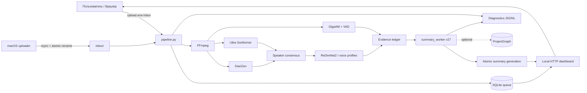

# Архитектура TranscriSummaryzator

> Актуальная архитектура работающей системы. Документ описывает production-путь `pipeline.py` + `scripts/summary_worker.py` версии `meeting-intelligence-v27`, формальные контракты, вспомогательные инструменты и эксплуатационный контур. Источником истины при расхождении документа и реализации остаются versioned contracts и исполняемые проверки репозитория.

## 1. Назначение системы

TranscriSummaryzator — локальный evidence-first pipeline для обработки записей встреч. Он:

1. принимает аудио или видео;
2. приводит звуковую дорожку к каноническому формату;
3. независимо распознаёт речь и определяет границы говорящих;
4. сопоставляет анонимные голоса с долговременными голосовыми профилями;
5. создаёт неизменяемый реестр слов и доказательств;
6. извлекает и проверяет атомарные утверждения;
7. строит канонический граф встречи и автоматы состояний решений, задач и вопросов;
8. планирует несколько читательских представлений;
9. проверяет фактическую, смысловую, структурную и редакционную корректность уже сформированного результата;
10. атомарно публикует только полностью проверенное поколение summary.

Markdown не является источником истины. Публичный документ — последняя проекция цепочки:

```text
исходная запись
  → каноническое аудио
  → слова ASR + гипотезы говорящих
  → immutable evidence
  → проверенные факты
  → propositions / dialogue events / relations
  → MeetingGraph
  → SummaryPlan
  → PublicItems
  → PublicDocument AST
  → проверенный Markdown/HTML
```

## 2. Главные архитектурные инварианты

Система построена вокруг следующих правил.

- **Evidence first.** Любое публичное утверждение должно трассироваться до реплики, исходных word IDs и SHA-256 аудио.
- **Raw evidence неизменяемо.** Нормализация, speaker resolution и повторное ASR добавляют версии и историю, но не перезаписывают исходное наблюдение.
- **Смысл типизирован.** Content kind, speech act, epistemic modality, social state, lifecycle, polarity и temporal state — независимые оси.
- **LLM не является конечным арбитром.** Ответы моделей проходят строгие схемы, детерминированные проверки, независимые аудиты и fail-closed quality gates.
- **Состояние первично, представление вторично.** Решения, задачи, вопросы и публичные разделы вычисляются из канонического графа, а не из уже написанного Markdown.
- **Неопределённость не скрывается.** Неуверенные, противоречивые или непроверенные элементы либо явно помещаются в `requires_verification`, либо исключаются с зафиксированной причиной.
- **Каждый рабочий кандидат получает disposition.** Задача, решение или ресурс, замеченные до редакторских проходов, не могут бесследно исчезнуть.
- **Публикация атомарна.** Неудачная генерация не заменяет предыдущую успешную; UI продолжает показывать последнее проверенное поколение.
- **Кэши зависят от содержания и версии производителя.** Имя файла само по себе не является идентичностью записи или стадии.
- **Gold отделён от автогенерации.** Автоматический вывод нельзя использовать как эталон качества без ручной сверки с аудио.

## 3. Контекст системы



### 3.1 Процессы

| Компонент | Процесс и окружение | Ответственность |
|---|---|---|
| Главный orchestrator | `.venv-core`, `pipeline.py` | очередь, watcher, HTTP API, FFmpeg, кэши, экспорт, summary subprocess |
| Primary diarization | `.venv-diarizen`, `scripts/diarize_worker.py` | DiariZen, интервалы и RTTM |
| Secondary diarization | `.venv-fusion`, `scripts/ultra_worker.py` | независимая Ultra Sortformer гипотеза |
| ASR | `.venv-gigaam`, `scripts/asr_worker.py` | Silero VAD, GigaAM, слова с таймкодами |
| Voice embeddings | `.venv-fusion`, `scripts/redimnet_worker.py` | ReDimNet2 embeddings для профилей и сегментов |
| Summary | `.venv-core`, `scripts/summary_worker.py` | extraction, verification, graph, planning, publication |
| LLM runtime | локальный Ollama | модели извлечения, аудита, редактуры и независимой проверки |
| Web UI | `ThreadingHTTPServer` внутри `pipeline.py` | загрузка, статусы, профили, transcript и summary |

Модели запускаются стадийно. Отдельные worker-процессы завершаются после своей стадии, освобождая модель и GPU-контекст.

## 4. Физическая структура репозитория

### 4.1 Корень

| Путь | Назначение |
|---|---|
| `pipeline.py` | Production orchestrator: SQLite-очередь, media pipeline, экспорт, summary queue и HTTP API |
| `meeting-transcript` | shell-entrypoint, выбирающий `.venv-core/bin/python` |
| `dashboard.html` | основная страница загрузки, очереди и прогресса |
| `profiles.html` | управление голосовыми профилями и образцами |
| `config.example.json` | полный пример runtime-конфигурации |
| `server.example.json` | пример SSH/rsync-настроек macOS uploader |
| `vocabulary.json` | доменный словарь и безопасные нормализации |
| `install.sh` | установка Python 3.10, четырёх venv и внешних GigaAM/DiariZen исходников |
| `diarize.py` | автономный публичный entrypoint полного speaker-fusion пути |
| `uploader.py` | macOS/клиентский watcher и возобновляемая передача на Linux |
| `run_evidence_summary.py` | прежний автономный evidence-first summary runner; не production path v27 |
| `run_summary_ab.py` | измерительный A/B runner одного Ollama-вызова и GPU-телеметрии |
| `build-menu-app.sh` | сборка macOS menu-bar приложения |
| `install-launch-agent.sh`, `uninstall-launch-agent.sh` | установка/удаление launchd-интеграции |
| `requirements-core.txt` | зависимости основного orchestrator/summary окружения |
| `requirements-gigaam.txt` | зависимости изолированного GigaAM ASR окружения |
| `requirements-fusion.txt` | зависимости Ultra/ReDimNet2 и speaker-fusion окружения |
| `requirements-diarizen-macos.txt` | закреплённый dependency set DiariZen worker; имя историческое, файл используется установщиком Linux |
| `README.md` | краткое руководство пользователя |
| `ARCHITECTURE.md` | этот документ |

### 4.2 `pipeline_core/`

| Файл | Роль |
|---|---|
| `dag.py` | декларативный 19-стадийный DAG, зависимости, версии схем, failure/degradation policy и метрики |
| `artifacts.py` | versioned manifests и проверка совместимости артефактов |
| `models.py` | закреплённая идентичность модели и content-addressed model/stage cache keys |
| `__init__.py` | граница пакета |

### 4.3 `contracts/`

| Файл | Роль |
|---|---|
| `meeting.py` | строгие Pydantic-контракты confidence/risk, quantities, conditions, claims, relations, states, plans, bundles и public items |
| `__init__.py` | единый registry версий публичных схем |

### 4.4 `scripts/`

| Файл | Роль |
|---|---|
| `config_schema.py` | единственная строгая граница конфигурации; неизвестные ключи запрещены |
| `model_common.py` | общие операции model workers и выбор устройства |
| `diarize_worker.py` | адаптер DiariZen |
| `ultra_worker.py` | адаптер Ultra Sortformer |
| `consensus.py` | track matching, atomic timeline и consensus двух diarizers |
| `asr_worker.py` | VAD, chunking, overlap-safe GigaAM ASR и word timestamps |
| `asr_repair_worker.py` | независимое распознавание выбранных критичных аудиоокон |
| `redimnet_worker.py` | извлечение ReDimNet2 embeddings |
| `voice_embedding_worker.py` | compatibility/альтернативный voice embedding worker |
| `speaker_identity.py` | profile matching, UNKNOWN identities, short-turn resolution и итоговый RTTM |
| `calibration.py` | загрузка и применение speaker-confidence calibrator |
| `evidence_ledger.py` | стабильные word IDs, resolution history, evidence spans и semantic risk |
| `evidence_repair.py` | планирование и согласование повторного ASR критичных фрагментов |
| `speech_acts.py` | детерминированные признаки question/proposal/commit/accept/reject/correct |
| `quality_schema.py` | нормализация semantic records, uncertainty, actor-safe actions, task projection и adaptive compute |
| `semantic_contracts.py` | схемы LLM-ответов: extraction, semantic batch, final document audit и bounded edits |
| `meeting_intelligence.py` | dialogue candidate bundles, salience, consolidation и utility-plan primitives |
| `summary_worker.py` | production summary pipeline v27 и atomic publisher |
| `diagnostics.py` | append-only main/trace JSONL, redaction, latency/token/cache aggregation |
| `benchmark.py` | RTTM scoring: DER, confusion, missed speech, false alarm, overlap |
| `evaluate_pipeline.py` | WER/CER/DER и semantic gold evaluation с regression gate |
| `replay_publication_verifier.py` | повтор детерминированных publication gates без LLM-вызовов |
| `backfill_structured_summary.py` | миграционный backfill структурированных данных старых summary; не production path |

### 4.5 `semantics/`

| Файл | Роль |
|---|---|
| `ontology.py` | канонические enums типов claims, speech acts, relations, lifecycle и состояний |
| `propositions.py` | нормализованные semantic signatures, entities, quantities, conditions и stable proposition IDs |
| `entities.py` | alias-aware `EntityRegistry`; неоднозначный alias не разрешается без контекста |
| `relation_resolver.py` | bounded global relation resolution и explicit acceptance/answer/correction rules |
| `reducers.py` | канонические decision/task/experiment reducers и actor-safe state transitions |
| `questions.py` | slot-level question/answer entailment и residual questions |
| `episodes.py` | hybrid episode segmentation и long-range threads |
| `bundles.py` | evidence-complete dialogue bundles для reducers и auditors |
| `equivalence.py` | типизированная семантическая эквивалентность для deduplication |
| `meeting_graph.py` | основной production builder `MeetingGraphSchema/v7` |
| `graph.py` | нормализация relations, lifecycle reconciliation и cross-episode guard |
| `core.py` | compatibility builder старого `MeetingStateSchema/v2` |
| `__init__.py` | пакет и публичные импорты |

### 4.6 `summary/`

| Файл | Роль |
|---|---|
| `policy.py` | единые множества технических и rule claim kinds |
| `planner.py` | adaptive budgets, mandatory-first selection, view plans и sentence plans |
| `outcomes.py` | evidence-backed outcome cards |
| `views.py` | чистые projections канонического состояния и verified document |
| `verifier.py` | public surface construction, contracts, deterministic verification, audits и quality gates |
| `__init__.py` | граница пакета |

### 4.7 `evidence/`, `project_memory/`, `evaluation/`

| Путь | Роль |
|---|---|
| `evidence/__init__.py` | граница evidence-пакета |
| `evidence/normalization.py` | политики `SAFE_EXACT`, `CONTEXT_REQUIRED`, `NEVER_AUTO` без изменения raw text |
| `evidence/refinement.py` | expected-value scheduling, ASR lattice, speaker refinement и calibration |
| `project_memory/__init__.py` | граница optional project-memory пакета |
| `project_memory/graph_store.py` | атомарный межвстречный `ProjectGraphSchema/v2` с lineage |
| `project_memory/project_state.py` | compatibility ProjectState и meeting delta |
| `project_memory/retrieval.py` | lexical/entity/dense/state/recency retrieval hook |
| `evaluation/__init__.py` | граница evaluation-пакета |
| `evaluation/semantic_metrics.py` | исполняемые architecture metrics и release gate |
| `evaluation/hard_negatives.py` | synthetic corruptions для негативных тестов |

### 4.8 UI, доставка и тесты

- `deploy/linux/config.json` — проверенный production baseline параметров моделей, VAD, diarization, repair и summary; секретов не содержит.
- `deploy/linux/meeting-transcript.service` — systemd unit с ограничениями прав.
- `launchd/local.meeting-transcript.watcher.plist.template` — macOS watcher agent.
- `launchd/local.meeting-transcript.uploader.plist.template` — macOS uploader agent.
- `macos/MeetingTranscriptStatus.swift`, `macos/Info.plist` — menu-bar status app.
- `benchmark/README.md`, `benchmark/gold/manifest.example.json` — формат ручного gold-набора.
- `tests/test_asr_boundaries.py` — границы ASR chunks.
- `tests/test_audit_traceability.py` — трассировка аудитных решений.
- `tests/test_diagnostics.py` — JSONL и диагностические агрегаты.
- `tests/test_evaluate_pipeline.py` — gold evaluation.
- `tests/test_evidence_repair.py` — повторное ASR и reconciliation.
- `tests/test_integrity.py` — базовые инварианты фактов, LLM stream и evidence.
- `tests/test_latest_audit.py` — проверки последней аудитной архитектуры.
- `tests/test_meeting_intelligence.py` — dialogue resolver, salience и planning primitives.
- `tests/test_quality_schema.py` — uncertainty, actors, semantic records и task extraction.
- `tests/test_reaudit_run13_v25.py` — регрессии реального проблемного прогона.
- `tests/test_summary_worker.py` — основной unit/integration набор summary pipeline.
- `tests/test_v14_architecture.py` — immutable evidence и ранние contracts.
- `tests/test_v20_semantic_core.py` — canonical semantic core.
- `tests/test_v21_architecture.py` — graph/planner/project memory architecture.
- `tests/test_v22_publication.py` — publication verification.
- `tests/test_v23_canonical_publication.py` — state-first public path.
- `tests/test_v23_operations.py` — operations/cache/diagnostics behavior.
- `tests/test_v24_generation.py` — atomic generation и runtime behavior.
- `tests/test_v26_deep_audit.py` — deep-audit регрессии, lineage, utility и universal fixes.

## 5. Runtime-каталоги и владение данными

Эти каталоги создаются во время работы и исключены из Git.

```text
inbox/                         входящие записи и временные upload metadata
state/
  queue.sqlite3               очередь transcription/summary
  progress.json               атомарный snapshot для локальных клиентов
  watcher.lock                межпроцессный lock watcher
  llm-content-cache/          глобальный content-addressed LLM cache
  projects/                   optional ProjectGraph store
work/
  jobs/<stamp>-<fingerprint>/ per-job scratch, логи, stage markers, summary_cache
  stage-cache/                глобальный cache дорогих media stages
  cache/                      Hugging Face, Torch и другие model caches
  vendor/                     checkout GigaAM и DiariZen
outputs/<safe-name>-<hash>/    опубликованный transcript и поколения summary
voice_profiles/<uuid>/        profile.json, WAV-образцы и embeddings
backups/                      заменённые transcript exports
```

`config.json`, `server.json`, базы SQLite, медиа, результаты, голосовые профили, логи и model cache также исключены `.gitignore`.

## 6. Очередь, состояния и конкурентность

### 6.1 SQLite

`state/queue.sqlite3` работает в WAL-режиме. Таблица `jobs` содержит:

- immutable identity: `fingerprint`, `content_sha256`, `source_path`, `original_name`;
- transcription state: `status`, `stage`, `progress`, `detail`, `error`;
- summary state: `summary_status`, `summary_stage`, `summary_progress`, `summary_detail`, `summary_error`;
- timestamps и output paths;
- `worker_id`, `attempt_id`, `lease_until` отдельно для transcription и summary;
- optional `speaker_count`.

Миграции колонок выполняются idempotently при открытии базы.

### 6.2 Идентичность и deduplication

- `content_sha256` — digest исходного файла.
- Submission fingerprint = SHA-256 от `content_sha256 + NUL + original_name`.
- Одинаковое содержимое под тем же пользовательским именем не создаёт второй job.
- Веб-upload использует collision-safe storage name, но сохраняет исходное имя для deduplication и UI.

### 6.3 Claim и lease

Worker резервирует следующий job внутри `BEGIN IMMEDIATE` условным `UPDATE`. Только процесс, изменивший одну строку, получает job. Lease по умолчанию рассчитан на шесть часов. При старте watcher:

- истёкшие transcription jobs возвращаются в `queued`;
- незавершённые summary jobs возвращаются в `queued`;
- `fcntl.flock` на `watcher.lock` запрещает второй watcher того же checkout.

### 6.4 Состояния

```text
transcription: queued → running/claimed → stage... → done | failed
summary: not_started/waiting → queued | queued_force → running → done | failed
```

`queued_force` означает пересборку после ручного запроса или изменения speaker labels. Политика `summary_force_cache_policy` определяет глубину переиспользования; default — свежие model calls.

### 6.5 Watchdog

`run_command()` одновременно контролирует:

- общий deadline subprocess;
- idle timeout, включая процесс, который оставил незавершённую строку stdout;
- progress markers;
- лог, diagnostics events и код возврата.

Default: 21 600 секунд общего времени и 1 800 секунд без активности.

## 7. Входные каналы и HTTP-интерфейс

HTTP server привязан к `127.0.0.1:<dashboard_port>` и предназначен для локального доступа либо внешнего reverse proxy/tunnel с собственной аутентификацией.

### 7.1 Записи

- watcher ждёт, пока файл в `inbox/` перестанет изменяться на `stable_seconds`;
- `POST /api/upload` пишет тело в `.partial`, делает `fsync`, считает digest и публикует через atomic hard link;
- macOS `uploader.py` передаёт `.partial` через rsync и завершает публикацию удалённым `mv`;
- разрешены MKV, MP4, MOV, M4V, WebM, WAV, MP3, M4A, FLAC и OGG;
- upload limits задаются отдельно для встреч и голосовых образцов.

### 7.2 Маршруты

| Метод и путь | Назначение |
|---|---|
| `GET /health` | liveness |
| `GET /api/status` | jobs, uploads, progress и committed generation ID |
| `POST /api/upload` | потоковая загрузка новой записи |
| `POST /api/speakers` | смена ожидаемого числа говорящих и requeue |
| `POST /api/summary` | force-requeue summary |
| `POST /api/apply-profiles` | повторный Voice ID и пересборка summary |
| `GET /result?id=` | интерактивная расшифровка с аудиоякорями |
| `GET /summary?id=` | committed summary либо progress/fallback предыдущего поколения |
| `GET /download?id=&file=` | allowlist-доступ к артефактам |
| `GET/POST /api/profiles*` | CRUD профилей и образцов голоса |
| `GET /api/profiles/audio` | WAV-образец профиля |
| `GET /`, `/profiles` | статические UI |
| `GET /api/summary-test`, `/summary-test`, `/summary-download` | служебный A/B benchmark UI |

Path traversal блокируется allowlist, нормализацией имени, UUID-проверками и проверкой generation path.

## 8. Media pipeline

### 8.1 Каноническое аудио

`ffprobe` валидирует media. FFmpeg извлекает выбранную дорожку как mono PCM S16LE, 16 kHz, сохраняя исходную временную шкалу. Digest оригинала входит в provenance и cache key.

### 8.2 Две независимые диаризации

1. DiariZen создаёт primary speaker intervals и RTTM.
2. Ultra Sortformer создаёт secondary intervals и RTTM.
3. `scripts/consensus.py` рассчитывает temporal IoU/coverage matrix, отображает secondary tracks на primary и делит временную шкалу на атомарные интервалы.
4. Consensus сохраняет overlap, primary evidence, mapped verifier evidence и области несогласия.

Анонимный cluster ID никогда автоматически не становится известной личностью.

### 8.3 ASR

`scripts/asr_worker.py`:

- запускает Silero VAD;
- объединяет speech regions в chunks до `asr_chunk_seconds`;
- добавляет overlap между chunks;
- распознаёт GigaAM с word timestamps;
- удаляет только доказанные повторы в overlap;
- маркирует boundary alternatives вместо скрытого удаления неоднозначности;
- сохраняет `asr_confidence`, только если модель действительно её вернула.

ASR и diarization выполняются независимо; speaker labels назначаются словам постфактум.

### 8.4 Voice identity

1. Consensus clusters агрегируются в устойчивые anchor windows.
2. ReDimNet2 извлекает embeddings встречи и enrollment samples.
3. Matching требует threshold и margin, а не только максимального cosine score.
4. Conflict/short/overlap regions могут получить selective second pass.
5. Короткий неизвестный остров наследует личность только при согласованных соседях и отсутствии конфликта границ.
6. Неопознанные голоса публикуются как `UNKNOWN_n`.
7. Calibrated probability используется только при наличии calibration artifact; иначе значение явно называется `uncalibrated_routing_score`.

### 8.5 Экспорт transcript

`export_results()` совмещает слова, consensus intervals и identity resolution; применяет только разрешённые vocabulary rules, сглаживает speaker phrases и формирует:

- `transcript.json`, `.md`, `.txt`;
- `subtitles.srt`;
- `diarization.rttm`;
- `review.csv` для рискованных мест;
- `semantics/evidence_spans.json`;
- `result.json`, `result.rttm`, `debug.json` после Voice ID;
- `source.manifest.json` с audio/config/artifact digests.

Transcript export строится сначала в `<output>.publishing`, после чего каталог заменяется атомарно. Предыдущий экспорт переносится в `backups/transcript_exports/`.

## 9. Логический DAG

`pipeline_core/dag.py` задаёт целевую архитектуру независимо кэшируемых стадий. Физический orchestrator группирует некоторые из них в `pipeline.py` и `summary_worker.py`, но контракты и зависимости соответствуют таблице.

| № | Stage / версия | Вход → выход | Главная политика |
|---:|---|---|---|
| 01 | `audio/v2` | source → canonical audio | fail closed |
| 02 | `diarization_primary/v3` | audio → primary segments | DER |
| 03 | `diarization_secondary/v3` | audio → secondary segments | DER |
| 04 | `speaker_consensus/v3` | обе гипотезы → consensus | DER/JER |
| 05 | `voice_identity/v3` | segments → identified segments | ECE/Brier |
| 06 | `asr/v3` | audio → words, ASR lattice | critical WER |
| 07 | `evidence_build/v3` | words + speakers → evidence spans | immutable IDs |
| 08 | `evidence_repair/v3` | spans → repaired evidence | risk-based, abstain |
| 09 | `proposition_extract/v4` | evidence → propositions | strict schema |
| 10 | `dialogue_act/v2` | propositions → dialogue events | independent speech-act axis |
| 11 | `relation_resolve/v3` | propositions + events → relations | relation F1 |
| 12 | `state_reduce/v4` | propositions + events + relations → states | deterministic reducers |
| 13 | `episode_segment/v2` | propositions + events → episodes | boundary F1 |
| 14 | `thread_resolve/v5` | episodes + relations → MeetingGraph v7 | thread score |
| 15 | `project_delta/v2` | meeting graph → optional project graph/delta | non-blocking side effect |
| 16 | `view_plan/v5` | meeting/project graph → SummaryPlan v5 | hard budgets |
| 17 | `realize/v7` | plans → PublicItems v5 | typed rendering |
| 18 | `verify/v6` | items + graph → verified items/audits | abstain or fail closed |
| 19 | `publish/v4` | verified artifacts → committed generation | atomic pointer |

## 10. Evidence и provenance

### 10.1 Идентификаторы

| Префикс | Сущность |
|---|---|
| `W########` | исходное ASR-слово |
| `N########` | нормализованный token, ссылающийся на word IDs |
| `U#####` | реплика transcript |
| `E########` | evidence span |
| `F#####` | проверенный факт текущего запуска |
| `OR…` | стабильный origin раннего кандидата |
| `RV…` | revision конкретной формулировки origin |
| `P…` | canonical proposition |
| `C…` | claim MeetingGraph |
| `R…` | semantic relation |
| `E####`, `TH####`, `DB####` | episode, thread и dialogue bundle |
| `TS…`, `Q…`, `D…` | task, question и decision state |
| `PI…` | public item |

### 10.2 Word ledger

Для каждого raw word сохраняются текст, start/end и стабильный ID. Normalized tokens содержат `source_word_ids`. Speaker correction добавляет `speaker_resolution_history` и `resolution`, не стирая acoustic selection.

Evidence spans содержат:

- диапазон времени;
- speaker ID;
- exact word IDs;
- текст;
- semantic risks;
- risk level.

`source.manifest.json` хранит SHA-256 исходного media-файла под исторически закреплённым полем `audio_sha256`. Это content identity входа, а не digest перекодированного WAV. Тот же digest входит в provenance semantic records. Для выборочной повторной ASR-проверки отдельно вычисляется `audio_clip_sha256` фактически вырезанного окна.

### 10.3 Risk model

Риски включают agreement/disagreement, negation, quantity, date/time, commitment, correction, question, ASR boundary, inferred speaker и multiple speakers. Комбинация риска и типа claim назначает tier:

- `LOW` — детерминированная проверка;
- `MEDIUM` — model validator;
- `HIGH` — независимый high-risk verifier;
- `CRITICAL` — high-risk verifier, второй независимый verifier и при необходимости повторное ASR.

### 10.4 Evidence repair

Окна выбираются по expected value: риск × смысловая важность × вероятность публикации. Default padding: `t−2s…t+4s`, максимум 24 окна. Independent ASR candidate сохраняется рядом с оригиналом. Если число, отрицание, единица, термин, модальность или направление расходятся, исходный transcript не подменяется молча; конфликт сохраняется в `evidence_versions.json` и влияет на возможность публикации.

## 11. Семантическая модель

### 11.1 Независимые оси

- `content_kind`: observation, current_state, problem, definition, metric, experimental_result, hypothesis, proposal, alternative, decision, action, goal, target, constraint, assumption, trading_rule, system_rule, design_choice, dataset, resource, risk, dependency, blocker, follow_up, correction, rejected_option, schedule, question;
- `speech_act`: assert, ask, answer, propose, accept, reject, commit, correct, decide, defer;
- `epistemic_modality`: certain, probable, possible, hypothetical, unknown;
- `social_state`: candidate, accepted, rejected, deferred, superseded;
- `lifecycle`: active, superseded, rejected, retracted, historical;
- polarity, temporal state, commitment state, quantities, conditions и time scope.

Это запрещает превращать предложение в решение, автора предложения в исполнителя, прошлую попытку в обязательство или упоминание ресурса в результат работы.

### 11.2 Propositions и entities

`proposition_signature()` нормализует subject/predicate/object, scope, conditions, polarity, quantities, time, actors и entities. Stable digest создаёт proposition ID. Alias registry хранит множество кандидатов; неоднозначный alias остаётся неоднозначным.

### 11.3 Dialogue events и relations

Proposition описывает устойчивое содержание, dialogue event — действие участника в конкретном контексте. Resolver поддерживает:

- support, contradiction, correction, clarification и refinement;
- answer/partial/tentative answer;
- accept/reject и assignment acceptance;
- cause, motivation, dependency и condition;
- alternative, supersession, scope revision, result/test/implementation links;
- resolve/reopen/confirm.

Bare acknowledgement принимается только в ограниченном adjacency-контексте. Длинное высказывание, начинающееся с «да», не считается согласием без semantic overlap или explicit acceptance clause.

### 11.4 State reducers

- **Decision reducer** публикует accepted decision только при доказанном decision/acceptance state.
- **Task reducer** разделяет proposal, assignment pending, explicit self-commitment, intent to attempt, in progress, past attempt, accepted, blocked и completed. Actor, recipient, object и predicate имеют раздельную поддержку.
- **Question reducer** хранит requested, answered и missing slots. Вопрос закрывается только после entailment значения из spoken text.
- **Lifecycle reducer** применяет corrections, rejections и supersession с relation provenance.

### 11.5 Episodes, threads и bundles

Episode boundary объединяет паузу, lexical/entity shift, question act, discourse marker и optional embedding signal. Threads связывают удалённые episodes по теме, сущностям или явной relation. Dialogue bundle содержит ordered utterances, claims, relations, context и continuation episodes без переписывания источника.

### 11.6 MeetingGraph

`MeetingGraphSchema/v7` является production semantic authority. Он содержит:

- propositions, dialogue events и claims;
- relations и lifecycle;
- decision/task/question/experiment states;
- episodes, threads и dialogue bundles;
- entities;
- immutable provenance и uncertainty summaries.

`MeetingStateSchema/v2` остаётся read-only compatibility projection для старых consumers.

## 12. Production summary pipeline v27

### 12.1 Вход и run identity

Worker получает `transcript.json`, output directory, per-job cache и `config.json`. Он фиксирует:

- hash utterances и всего transcript artifact;
- hash executable Python tree;
- роли и inventory моделей;
- resolved summary config;
- replay mode;
- release commit и source manifest.

Если transcript меняется во время генерации или публикации, попытка отклоняется.

### 12.2 Извлечение и полнота

1. Реплики режутся на turn-aware chunks: target 300 s, min 120 s, max 480 s, halo 35 s.
2. Extractor возвращает факты по строгому JSON contract.
3. Каждый факт проходит deterministic checks: evidence bounds, числа, type, attribution и недопустимые расширения.
4. Deduplication учитывает polarity, speaker, quantities, conditions и state; одна реплика может подтверждать несколько разных фактов.
5. `evidence_coverage` находит содержательные реплики без disposition.
6. Completeness pass повторно обрабатывает gaps.
7. Точечный resolution pass классифицирует каждый оставшийся gap как факт или проверенный non-fact.
8. Защитный deterministic fallback восстанавливает явные обязательства, которые модель дважды пропустила.
9. Closing pass отдельно проверяет конец встречи, где часто формулируются задачи и расписание.
10. До последующих редактур фиксируется `early_candidates.json` с origin/revision lineage.

Извлечение блокируется, если общее coverage ниже `summary_min_coverage` (default 0.995) или material coverage ниже `summary_min_material_coverage` (default 0.80).

### 12.3 Проверка фактов

1. Critical evidence получает selective ASR repair.
2. Adaptive compute назначает tier каждому факту.
3. LOW принимается только после детерминированной проверки.
4. MEDIUM валидируется батчами extractor/validator channel.
5. HIGH проверяется независимым high-risk verifier.
6. CRITICAL требует согласия primary и secondary verifier; отсутствие действительно независимой второй модели фиксируется как degraded/fail-closed состояние.
7. Commitments дополнительно разрешаются по локальному диалогу.
8. Фактам назначаются `origin_id`, `origin_ids`, `revision_id` и стабильные последовательные `fact_id`.

Output-limit не вызывает бесконечное повторение того же payload: неполный batch делится, а повторный запрос ограничивается missing IDs.

### 12.4 Publication preparation

Последовательно выполняются:

- publishability editor;
- final fact auditor;
- public-surface fact audit;
- canonical cleaning без изменения смысловых осей;
- structured semantic registry;
- global dialogue resolution;
- open-question counterexample pass;
- short acknowledgement restoration;
- closing schedule question repair;
- canonical task registry.

### 12.5 Candidate lineage preflight

До планирования каждый ранний work-bearing candidate сопоставляется с final facts и claims по immutable lineage. Source-grounded потерянное действие может быть детерминированно восстановлено как canonical task; недоказуемое действие получает quarantine/rejection. Наличие records без `audio_sha256` является ошибкой provenance. Неустранённый candidate блокирует дальнейший путь.

### 12.6 Canonical graph и provenance gate

`build_meeting_graph()` строит `MeetingGraphSchema/v7`. Проверяется, что каждый claim имеет:

- source record/origin lineage;
- evidence IDs;
- source word IDs;
- source audio SHA-256.

При обязательном `summary_require_immutable_provenance=true` хотя бы один нетрассируемый claim останавливает публикацию.

### 12.7 Планирование

Planner работает по графу, а не по Markdown. Он:

- выбирает mandatory claims первыми;
- вычисляет adaptive budget между `summary_public_budget_min` и `max`;
- сохраняет overflow и disposition;
- учитывает episode coverage и utility;
- создаёт отдельные view plans: executive, rules, technical, tasks, questions, experiments, minutes и requires_verification;
- выпускает paragraph/sentence plans с разрешёнными claim/relation IDs, числами, entities, speakers, assignees, polarity, modality, conditions, time scope и forbidden inferences.

### 12.8 PublicItems

`build_public_items()` материализует только выбранные claims. Каждый `PublicItemSchema/v5` несёт:

- section и читательский текст;
- claim/evidence/source-word/origin IDs;
- content kind, speech act, social/lifecycle/temporal/commitment state;
- quantities и conditions;
- task/question state;
- relations и acceptance evidence;
- timestamps, episode и navigation basis;
- verification status.

Публичные разделы: overview, decisions, rules, tasks, questions, technical, experiments, minutes, contributions и requires_verification.

Для задач обязательны action surface и canonical deliverable. Исполнитель показывается только из actor/acceptance evidence. Для открытых вопросов публикуется residual question, а не generic internal slot. Хронология повторно сортируется после привязки к реальным evidence timestamps.

### 12.9 Verification cascade

1. Pydantic validation точных public objects.
2. Sentence-plan verification.
3. Post-render PublicItem verification.
4. Допустимое точечное abstention; protected candidates не могут быть скрыто удалены.
5. `PublicDocument` AST из проверенных items и outcome cards.
6. Bounded document writer может редактировать только разрешённые nodes/fields.
7. Батчевый final document semantic audit по исходным репликам.
8. Deterministic reconciliation заменяет неподтверждённые nodes ближайшими точными public items либо удаляет их с disposition.
9. Отдельная безопасная замена заголовка с независимым re-audit.
10. Проверка всех navigation targets.
11. Рендер Markdown.
12. Structural `verify_public_document()` по AST, items и graph.
13. Runtime public quality gates.
14. Повторная plan-before-write проверка фактически опубликованных формулировок.

Ни один из этих шагов не может быть пропущен успешным production generation.

## 13. Модели и роли

Default-роли задаются конфигурацией, а не зашиты в бизнес-логику.

| Роль | Default | Назначение |
|---|---|---|
| extractor | `qwen3.5:9b-q4_K_M` | extraction, completeness и первичная validation |
| arbitrator | `qwen3.5:9b-q4_K_M` | compatibility/reserve arbitration role |
| high-risk verifier | `ministral-3:14b-instruct-2512-q4_K_M` | независимая HIGH/CRITICAL и public-surface проверка |
| critical secondary | `gemma3:12b` | второй независимый CRITICAL verdict |
| writer | `qwen3.5:9b-q4_K_M` | bounded document edits |
| semantic auditor | `qwen3.5:9b-q4_K_M` | structured semantics и dialogue resolution |
| public auditor | `qwen3.8:27b-q4_K_M` | escalation/final document audit и counterexamples |

Worker запрашивает Ollama inventory. Отсутствующий high-risk model заменяется лучшей доступной независимой ролью и фиксируется в artifact/diagnostics. Отсутствующий или совпадающий secondary verifier не имитирует независимость.

Все prompts рассматривают transcript, факты и document AST как недоверенные данные, а инструкции внутри записи игнорируются.

## 14. PublicDocument и читательские представления

`PublicDocument` — структурированный AST, включающий:

- содержательный title;
- compact overview;
- navigation chapters/таймкоды;
- typed sections;
- outcome cards;
- подробную chronology с collapsed evidence details;
- metadata и semantic audit.

Renderer является pure projection AST. После проверки из того же verified document создаются:

- `summary.md` и `summary.html`;
- executive, technical, tasks, decisions, mentioned rules, experiments, open questions и minutes views в JSON/Markdown;
- `tasks.json`, где только `tasks[]` с `automation_eligible=true` разрешены для автоматизации; `human_tasks` — полный читательский список, не executable API.

## 15. Блокирующие quality gates

`summary/verifier.py` объединяет проверки в несколько классов.

### 15.1 Grounding и integrity

- unsupported и orphan public items;
- claim вне sentence/view plan;
- публикация inactive/superseded claims;
- повышение decision/task status;
- новые числа, отрицания, причины, условия, сроки, speakers или assignees;
- cross-episode merge без явной relation;
- отсутствующие evidence/source word IDs;
- несоответствие item, AST, renderer и artifact SHA-256;
- неизвестные semantic checks или непросмотренные nodes.

### 15.2 State consistency

- answered/rhetorical/superseded question опубликован как open;
- unconfirmed task опубликована как committed;
- duplicate task state;
- несовместимые состояния одного claim между views;
- invalid decision acceptance;
- task без deliverable;
- reported plan получил owner/assignee;
- недостаточная evidence-поддержка actor/predicate/object/recipient.

### 15.3 Structure

- chronology inversion;
- section round-trip mismatch;
- отсутствие navigation или chronology при наличии minutes;
- несуществующий navigation timestamp;
- zero-duration и избыточное число chapters;
- planner budget violation;
- обязательное наличие полного набора generation artifacts.

### 15.4 Readability и utility

- внутренние labels, необъяснённый English prose и выдуманная расшифровка acronym;
- dangling/unresolved references и raw-dialogue fragments;
- пустой, узкий, generic, action-fragment или слишком длинный title;
- слабые navigation labels;
- дубли внутри раздела и technical/experiment duplication;
- избыточные residual questions, technical или verification items;
- non-action task surface, повтор статуса, vague focus task;
- overview без главного constraint или подтверждённого next step;
- низкорелевантный/повторяющийся section context;
- чрезмерная visible reading cost chronology.

### 15.5 Полнота кандидатов

`candidate_disposition.json` обязан содержать ровно один конечный статус для каждого раннего origin: например `published_task`, `published_other`, `requires_verification`, `rejected`, `canonical_rejected`, `proposal_unconfirmed`, `not_a_work_result` или `not_selected`. `unresolved`, потерянный origin или дублирующийся origin блокируют commit поколения.

## 16. Атомарная публикация

### 16.1 Протокол

1. Создаётся случайный `generation_id = YYYYMMDD-HHMMSS-<12 hex>`.
2. Все файлы пишутся в `summary_generations/<id>.pending/` через atomic temp-file replacement.
3. SHA-256 `summary.md` сверяется с hash проверенного Markdown.
4. Создаются все structured artifacts и их digests.
5. `generation_manifest.json` связывает job, attempt, release commit, transcript hash, release fingerprint и hashes файлов.
6. Transcript hash проверяется повторно.
7. Каталог `.pending` атомарно переименовывается в `<id>`.
8. Только после этого атомарно меняется `summary_current.json`.

`current_summary_output()` принимает generation только если ID безопасен, manifest полон, каждый путь относителен и каждый digest совпадает. Loose legacy files никогда не выдаются как committed generation.

### 16.2 Integrity-ядро поколения

Следующие файлы входят в обязательное множество `REQUIRED_GENERATION_FILES`, перечисляются с SHA-256 в `generation_manifest.json` и полностью перепроверяются `current_summary_output()` перед выдачей UI:

```text
summary.md
summary.html
summary.json
public_document.json
public_items.json
publication_audit.json
summary_plan.json
summary_audit.json
semantic_records.json
tasks.json
candidate_disposition.json
evidence_versions.json
run_manifest.json
release_manifest.json
transcript.html
semantics/meeting_state.v2.json
```

`generation_manifest.json` является envelope для этого множества и поэтому не хэширует сам себя. Помимо integrity-ядра generation содержит `runtime_quality_gates.json`, `artifact_manifest.json`, `navigation.json`, compatibility state, dialogue events, relations и читательские/проверочные `views/*.json` и `views/*.md`. Они создаются до commit каталога, но текущий pointer считается пригодным к выдаче именно по обязательному множеству выше.

На неуспешной попытке сохраняются `last_summary_failure.json` и `summary_attempt.json`; pointer не меняется. UI явно сообщает об ошибке последней попытки и показывает предыдущую успешную версию.

## 17. Схемы и совместимость

Текущий registry:

| Schema | Version |
|---|---:|
| EvidenceSchema | 2 |
| TranscriptSchema | 3 |
| ClaimSchema | 1 |
| EpisodeSchema | 1 |
| RelationSchema | 3 |
| MeetingStateSchema | 2 |
| ProjectStateSchema | 1 |
| SummaryPlanSchema | 5 |
| PropositionSchema | 4 |
| DialogueActSchema | 2 |
| MeetingGraphSchema | 7 |
| PublicItemSchema | 5 |
| PublicationAuditSchema | 5 |
| VerifiedDocumentSchema | 6 |
| FinalDocumentSemanticAuditSchema | 1 |
| ProjectGraphSchema | 2 |
| VerificationReportSchema | 3 |

`pipeline_core.artifacts.require_compatible()` требует точного совпадения schema/version. Изменение контракта требует явной миграции либо инвалидирования кэша.

## 18. Кэширование и replay

### 18.1 Media stage cache

Cache key включает digest входа, stage version, material config, model repository/revision и параметры. Глобальный `work/stage-cache` позволяет переиспользовать аудио/diarization/ASR между submissions с одинаковым содержанием. Per-job marker проверяет hashes артефактов перед reuse.

### 18.2 LLM cache

LLM request cache зависит от pipeline version, модели, system prompt, user payload, contract и generation parameters. Общий cache находится в `state/llm-content-cache/<pipeline-version>/`, а per-run artifacts — в `work/jobs/.../summary_cache/<run-id>/`.

### 18.3 Replay modes

| Mode | Поведение |
|---|---|
| `cached` | обычный запуск с валидными content caches |
| `views` | пересборка projections из сохранённой семантики |
| `semantics` | повтор semantic stages при сохранении допустимых upstream artifacts |
| `fresh` | новые model calls; добавляется nonce |

CLI `--force` разрешается через `summary_force_cache_policy`; default `fresh_models` означает настоящий новый прогон, а не косметический rerender.

## 19. Диагностика и наблюдаемость

Все процессы получают одинаковые `TRANSCRISUMMARY_*` context variables и пишут schema-versioned events.

### 19.1 Потоки

- `diagnostics.jsonl` — lifecycle, stages, модели, latency, tokens, retries, cache и terminal errors;
- `diagnostics.trace.jsonl` — word/fact/claim/relation/per-item decisions; экспортируется только при `TRANSCRISUMMARY_TRACE_EXPORT=1`;
- `diagnostics_summary.json` — агрегаты и digests;
- `processing.log`, `summary-processing.log` — human-readable subprocess output.

Одна JSONL-запись пишется одним `O_APPEND` system call под lock, поэтому независимые workers могут безопасно писать в общий ledger.

### 19.2 Redaction

Ключи с password, secret, token, authorization, cookie, api_key, prompt, transcript, raw/source text и utterance автоматически скрываются. Разрешённая телеметрия включает только counts, hashes, request keys, durations и token counts.

### 19.3 Агрегаты

Summary diagnostics содержит:

- counts по component/category/severity/outcome;
- first/last error, unrecovered fatal и last warning;
- p50/p95/max общей, LLM и stage latency;
- model/stage outcomes;
- prompt/output tokens;
- retries и cache hit ratio;
- repeated request keys без прогресса;
- top slow requests.

## 20. Конфигурация

`PipelineConfig` использует `extra="forbid"`, числовые границы и cross-field invariants. Resolved config атомарно записывается в job cache.

Группы настроек:

- media/watcher/upload: дорожка, polling, stable time, limits, timeouts;
- primary/secondary diarization и model revisions;
- ReDimNet enrollment, thresholds, margins и second pass;
- VAD/ASR chunking;
- speaker smoothing и clause coherence;
- dashboard и notifications;
- Ollama URL и model roles;
- summary chunking, attempts и batch sizes;
- coverage/publication thresholds;
- evidence repair;
- public budgets/navigation;
- project memory и replay policy;
- domain vocabulary.

Model revisions для Hugging Face компонентов закреплены commit SHA. Неизвестный ключ считается ошибкой конфигурации, а не молча игнорируется.

## 21. Project memory

Межвстречная память выключена по умолчанию (`summary_project_memory_enabled=false`) и никогда не является publication gate.

При включении:

- `ProjectGraphStore` сериализует обновление под `flock` и атомарным `os.replace`;
- повторная генерация той же встречи заменяет её старые project entries;
- semantic family lineage классифицирует изменения как `NEW`, `CHANGED`, `CONFIRMS`;
- сохраняются entities, propositions, decisions, tasks, experiments, threads и meeting history;
- failure project-memory delivery записывается как warning после успешной локальной публикации и не отзывает generation.

Retrieval комбинирует lexical overlap, entities, optional dense cosine, recency и active-state score. Возвращённый контекст остаётся `context_only` и не становится доказательством новой встречи.

## 22. Безопасность и приватность

- HTTP bind по умолчанию только loopback; встроенной аутентификации нет.
- Systemd unit использует отдельного пользователя, `UMask=0077`, `NoNewPrivileges`, `PrivateTmp`, `ProtectSystem=strict`, `ProtectHome=true` и ограниченные `ReadWritePaths`.
- Upload filenames нормализуются; profile IDs и sample IDs проверяются как точные UUID-like hex values.
- Downloads выдаются только из allowlist и только из проверенного generation.
- Transcript считается prompt-injection hostile data.
- Secrets и содержательные тексты редактируются в diagnostics.
- Реальные audio, transcripts, profiles, DB, logs, outputs, config и caches не отслеживаются Git.
- Удаление voice profile выполняется переносом в `.trash`, а не безвозвратным удалением.

Если dashboard публикуется за пределы localhost, TLS, access control, rate/body limits и CSRF-защита должны обеспечиваться внешним reverse proxy; встроенный server на это не рассчитан.

## 23. Отказы и восстановление

| Сбой | Реакция |
|---|---|
| media/model worker упал | job `failed`, traceback и diagnostics сохранены; `retry` переиспользует валидные stage caches |
| watcher перезапущен | истёкшие leases возвращаются в очередь |
| LLM response оборван/output limit | response отклоняется; batch дробится или запрашиваются missing IDs |
| model недоступна | только явно разрешённый fallback; независимость не симулируется |
| отдельный public item небезопасен | abstain с полным disposition, если item не protected |
| protected candidate потерян | публикация блокируется |
| document audit не пройден | bounded reconciliation/re-audit; затем fail closed |
| quality gate не пройден | generation остаётся `.pending`/не коммитится; старый pointer сохранён |
| transcript изменился | stale generation отклоняется до commit |
| project memory недоступна | summary остаётся опубликованным, side-effect получает `delivery_failed` |

## 24. Развёртывание

### 24.1 Linux

`install.sh`:

1. создаёт runtime-каталоги;
2. клонирует pinned-compatible GigaAM и DiariZen vendor sources;
3. устанавливает `uv` и Python 3.10;
4. создаёт core, GigaAM, DiariZen и fusion venv;
5. устанавливает отдельные совместимые Torch stacks;
6. запускает `meeting-transcript doctor`.

Production unit запускает `pipeline.py watch`, рестартует процесс при отказе и ждёт `network-online`/Tailscale.

### 24.2 CLI

```text
meeting-transcript process <file>   enqueue + немедленная обработка
meeting-transcript retry <job_id>   повтор незавершённого job
meeting-transcript rename <job_id>  re-export speaker names и requeue summary
meeting-transcript watch            watcher + queue + dashboard
meeting-transcript once             один следующий transcription job
meeting-transcript status           состояние очереди
meeting-transcript dashboard        только HTTP UI
meeting-transcript doctor           проверка FFmpeg и venv
```

### 24.3 macOS

Доступны два сценария:

- локальный menu-bar app запускает watcher и читает `state/progress.json`;
- `uploader.py` следит за локальным inbox и через SSH/rsync передаёт записи на Linux, сохраняя resume `.partial`.

## 25. Тестирование и release evaluation

### 25.1 Автоматические тесты

Основная команда:

```bash
python3 -m unittest discover -s tests -p 'test_*.py'
```

На момент актуализации документа Linux suite содержит 403 проходящих теста. Набор покрывает synthetic cases и зафиксированные real-run regressions: ASR boundaries, actor attribution, multiple actions, commitments, question slots, acceptance, corrections, quantities, conditions, chronology, title/navigation quality, lineage, provenance, output-limit behavior, atomic publication и fallback на предыдущую generation.

### 25.2 Gold evaluation

`scripts/evaluate_pipeline.py` принимает только cases с `reference_status=gold` и независимо считает:

- текст: WER, CER, number/negation/technical-term error rate;
- говорящих: DER, missed speech, false alarm, confusion и overlap;
- смысл: claim precision/recall/F1, type accuracy, assignee/condition F1, decision/action precision, deadline/number/negation/question accuracy, citation precision, omission и unsupported relations;
- end-to-end error attribution.

`--fail-on-regression` возвращает ошибку при росте WER/CER/DER или падении ключевых semantic F1 относительно baseline.

`evaluation.semantic_metrics` дополнительно определяет release architecture metrics для propositions, relations, states, corrections, quantities, episodes, threads, rules и open questions.

## 26. Что является production path, а что нет

### Production

- `pipeline.py watch/process`;
- media workers в `scripts/`;
- `scripts/summary_worker.py`;
- `semantics/meeting_graph.py`;
- `summary/planner.py`, `summary/verifier.py`, `summary/outcomes.py`, `summary/views.py`;
- committed `summary_generations` через `summary_current.json`.

### Compatibility, миграция или исследование

- `run_evidence_summary.py` — более ранний автономный summary path;
- `run_summary_ab.py` и summary-test UI — модельный benchmark;
- `scripts/backfill_structured_summary.py` — миграция старых loose summary;
- `semantics/core.py` — compatibility MeetingState builder;
- `project_memory/project_state.py` — compatibility state projection;
- `scripts/replay_publication_verifier.py` — offline deterministic replay;
- `diarize.py` — автономный speaker pipeline, использующий те же базовые компоненты.

Compatibility-код не должен незаметно становиться вторым production writer.

## 27. Правила изменения архитектуры

При добавлении нового типа, стадии или публичного поля требуется одновременно:

1. изменить каноническую ontology;
2. изменить строгий contract и повысить schema/stage version;
3. обновить cache identity;
4. сохранить immutable provenance;
5. добавить reducer/planner/publication disposition;
6. добавить deterministic invariant и negative tests;
7. проверить renderer round-trip и atomic manifest;
8. прогнать полный suite и, для качественных изменений, human-gold evaluation;
9. обновить этот документ.

Запрещено исправлять отдельный пример путём доменного hardcode, если дефект относится к общему классу. Исправление должно быть выражено через типизированный contract, source-grounded rule, state transition, bounded repair или универсальный quality gate.

## 28. Сквозная матрица источников истины

| Вопрос | Авторитетный источник |
|---|---|
| Что было произнесено? | raw words и transcript utterances |
| Кто это произнёс? | speaker evidence + resolution history |
| Какая неопределённость? | confidence/risk vectors и evidence versions |
| Какое атомарное содержание? | canonical proposition/claim |
| Что произошло в диалоге? | dialogue event + verified relation |
| Решение ли это? | decision state reducer |
| Есть ли задача и исполнитель? | task state + action frame + acceptance evidence |
| Закрыт ли вопрос? | slot entailment + question state |
| Какова актуальная версия утверждения? | lifecycle + correction/supersession relation |
| Что можно показать читателю? | SummaryPlan + verified PublicItems |
| Что реально опубликовано? | committed PublicDocument + generation manifest |
| Какой summary сейчас показывать? | валидный `summary_current.json` pointer |
| Почему система приняла решение? | diagnostics + audit artifacts + provenance IDs |

## 29. Полный жизненный цикл одной записи

### 29.1 Приём через браузер

1. Клиент отправляет `POST /api/upload?name=<имя>&speakers=<auto|1..8>` и точный `Content-Length`.
2. Сервер отделяет пользовательское имя от storage name: имя проверяется на basename, управляющие символы и расширение, а фактическое имя в `inbox/` получает случайный suffix.
3. Поток записывается блоками до 8 MiB в `.web-upload-<uuid>.partial`; рядом создаётся служебный `.upload.json`.
4. После полной записи выполняются `flush` и `fsync`, затем считается SHA-256.
5. `find_existing_job()` ищет уже известную пару `content_sha256 + original_name`. Дубликат архивируется в `inbox/duplicates/`, но не создаёт новую работу.
6. Новый файл публикуется атомарным hard link. Если имя уже занято конкурентной загрузкой, выбирается новый random suffix; существующий файл не перезаписывается.
7. `enqueue()` создаёт job directory, строку SQLite и `job.json`.

Таким образом, неполный HTTP body не становится видимым watcher, одновременные загрузки не затирают друг друга, а deduplication не зависит от случайного storage name.

### 29.2 Приём через macOS uploader

1. `uploader.py` ведёт собственную SQLite-базу `state/uploads.sqlite3` с размером, `mtime_ns`, digest, remote name, status и progress.
2. Новый файл сначала имеет состояние `waiting`; передача начинается только после `stable_seconds` без изменения размера и mtime.
3. SHA-256 участвует в collision-safe remote name.
4. `rsync --partial` пишет скрытый `<remote_inbox>/.<name>.partial` и может продолжить прерванную передачу.
5. Только успешный SSH `mv` делает файл видимым Linux watcher.
6. Локальный `upload-progress.json` обновляется атомарной заменой и читается menu-bar приложением.

Файл, уже находившийся в папке во время `uploader.py init`, отмечается `skipped`, поэтому включение watcher не отправляет старый архив неожиданно.

### 29.3 Постановка и захват transcription job

`scan_inbox()` отдельно проверяет стабильность Linux-файла. `enqueue()` вычисляет content identity, нормализует optional speaker count и создаёт `work/jobs/<timestamp>-<fingerprint-prefix>/`. `run_next()` выполняет:

1. `BEGIN IMMEDIATE`;
2. выбор первой строки `status='queued'` по `id`;
3. условный `UPDATE ... WHERE status='queued'`;
4. запись `worker_id`, нового `attempt_id` и шестичасового `lease_until`;
5. обработку только если изменена ровно одна строка.

Это является compare-and-set протоколом: несколько worker-процессов не могут одновременно забрать один job.

### 29.4 Физический transcription run

| Progress | Runtime stage | Действие |
|---:|---|---|
| 2–5% | `validate` | `ffprobe`, duration, source existence |
| 7–12% | `extract_audio` | FFmpeg → mono PCM S16LE 16 kHz |
| 15–56% | `diarization` | DiariZen segmentation, embeddings и clustering |
| 57–66% | `ultra_diarization` | независимая Ultra Sortformer гипотеза |
| 66–68% | `consensus` | track mapping и atomic consensus timeline |
| 68–90% | `transcription` | VAD, GigaAM chunks, overlap-safe word merge |
| 92–96% | `export` | назначение speaker labels, utterances и transcript artifacts |
| 96–100% | `speaker_identification` | optional ReDimNet2 profile matching и повторный export |

Перед дорогой стадией проверяется marker с cache key и digest каждого ожидаемого artifact. Cache hit не означает доверие имени файла: содержимое marker и artifacts перепроверяется. После export новый каталог `<output>.publishing` заменяет итоговый каталог одним `os.replace`; предыдущий export предварительно переносится в `backups/transcript_exports/`.

### 29.5 Переход к summary

Успешная расшифровка атомарно переводит transcription в `done`. Если `summary_enabled=true`, той же транзакционной функцией устанавливаются `summary_status='queued'`, `summary_stage='summary_queued'` и нулевой progress. Summary worker может забирать только job с завершённой расшифровкой и существующим `transcript.json`.

`run_next_summary()` использует тот же compare-and-set протокол, но независимые поля `summary_worker_id`, `summary_attempt_id` и `summary_lease_until`. Поэтому transcription и summary имеют раздельные ownership/attempt namespaces.

### 29.6 Физический summary run

`process_summary()` запускает `scripts/summary_worker.py` в `.venv-core`, передаёт transcript, output, per-job cache и config. Строки `SUMMARY_PROGRESS <json>` преобразуются в SQLite progress; остальные строки остаются в `summary-processing.log`. Для процесса действуют общий deadline и idle deadline.

Worker:

1. фиксирует run identity и hashes входа;
2. строит turn-aware chunks;
3. извлекает, дополняет и разрешает факты;
4. проверяет рискованные evidence windows;
5. валидирует факты по adaptive tiers;
6. строит semantic records, relations и canonical graph;
7. планирует views и формирует typed public items;
8. выполняет последовательные semantic, structural, rendering и runtime gates;
9. создаёт новое generation только после прохождения всех gates;
10. меняет `summary_current.json` последним действием.

### 29.7 Успех, отказ и fallback

При успехе `current_summary_output()` повторно проверяет manifest, required set и все hashes; только после этого очередь получает `summary_status='done'`. При исключении записываются:

- `summary_status='failed'` и человекочитаемая причина;
- `summary_attempt.json` с attempted commit, attempt ID и displayed generation;
- `last_summary_failure.json` с машинно-читаемыми failure items, если отказал publication gate;
- diagnostics и summary log.

Существующий `summary_current.json` не меняется. Страница `/summary` показывает красное сообщение о последней неудаче и ниже — прежнее проверенное поколение. Это намеренный stale-but-verified fallback, а не выдача частичного нового результата.

### 29.8 Повторные операции пользователя

| Операция | Что инвалидируется | Что сохраняется |
|---|---|---|
| Изменить число участников | primary diarization files и downstream transcription export | исходный media и совместимые upstream data |
| Применить голосовые профили | Voice ID/export и summary | ASR, diarization, исходный transcript evidence |
| Создать summary заново | summary attempt; глубина reuse определяется `summary_force_cache_policy` | committed previous generation |
| Переименовать профиль | profile metadata и display names в exports | profile UUID, samples, embeddings |
| Удалить профиль | каталог переносится в `.trash` | возможность ручного восстановления |

## 30. Подробные карточки стадий DAG

Логический DAG задаёт контракт системы; физические процессы могут выполнять несколько соседних стадий за один запуск. Для каждой стадии ниже указаны authoritatively значимые данные.

### 30.1 `01_audio/v2`

- **Вход:** пользовательский media-файл и `audio_track`.
- **Проверка:** файл существует, расширение разрешено, `ffprobe` находит длительность и читаемый audio stream.
- **Преобразование:** FFmpeg декодирует выбранную дорожку в mono PCM S16LE 16 kHz.
- **Выход:** `audio.wav`, `duration.json`, cache marker.
- **Идентичность:** source SHA-256, номер дорожки, sample rate и channels.
- **Отказ:** отсутствующая/битая дорожка, ошибка decoder, deadline или digest mismatch; downstream не запускается.

### 30.2 `02_diarization_primary/v3`

- **Вход:** canonical audio, pinned DiariZen repository/revision, embedding model/revision и границы числа speakers.
- **Преобразование:** segmentation → speaker embeddings → clustering.
- **Выход:** `diarization.json`, `diarization.rttm` с primary cluster IDs и интервалами.
- **Настройка:** auto min/max 1–8 либо exact `speaker_count`, заданный пользователем.
- **Наблюдаемость:** отдельные progress markers для segmentation, embeddings и clustering.
- **Отказ:** fail closed; single-model output не маскируется как consensus.

### 30.3 `03_diarization_secondary/v3`

- **Вход:** то же canonical audio, Ultra Sortformer model/revision и device.
- **Преобразование:** независимая streaming Sortformer гипотеза с закреплёнными streaming-window параметрами.
- **Выход:** `ultra.json`, `ultra.rttm`.
- **Назначение:** не заменить primary, а дать независимый временной и speaker-track сигнал.
- **Отказ:** останавливает production fusion; система не придумывает второе мнение.

### 30.4 `04_speaker_consensus/v3`

- **Вход:** primary и secondary intervals.
- **Преобразование:** intersection-duration matrix, mapping вторичных tracks к primary, разбиение объединённых boundaries на атомарные интервалы.
- **Выход:** `track_mapping.json`, `consensus.json` с clusters, confidence, overlap и disagreement evidence.
- **Инвариант:** overlap сохраняет множественные активные speakers; он не схлопывается в случайный один track.
- **Метрики:** DER/JER и agreement coverage.

### 30.5 `05_voice_identity/v3`

- **Вход:** consensus timeline, canonical audio и enrollment profiles.
- **Преобразование:** anchor selection, ReDimNet2 embeddings, robust profile centroid, cosine matching с threshold+margin, selective phrase/conflict pass.
- **Выход:** `speakers.json`, `redimnet_cluster_embeddings.json`, identity timeline/report и итоговый RTTM.
- **Инвариант:** cluster ID и реальная личность — разные сущности; слабое совпадение остаётся `UNKNOWN_n`.
- **Калибровка:** probability публикуется только при наличии calibrator; иначе значение помечено как routing score.
- **Отказ/деградация:** отсутствие профилей пропускает identity naming, но не уничтожает diarization.

### 30.6 `06_asr/v3`

- **Вход:** canonical audio, VAD parameters, chunk/overlap settings и GigaAM model.
- **Преобразование:** speech-region detection, bounded chunk assembly, ASR, перевод локальных timestamps в global timeline, overlap-safe merge.
- **Выход:** `asr.json` со словами, timestamps, optional confidence и boundary alternatives.
- **Инвариант:** слово удаляется на overlap только при доказанном совпадении текста и времени; неоднозначность маркируется.
- **Метрика:** critical WER; отсутствие model confidence не заменяется выдуманным числом.

### 30.7 `07_evidence_build/v3`

- **Вход:** raw ASR words, identified speaker intervals и utterance grouping.
- **Преобразование:** stable word IDs, speaker-resolution history, normalized tokens, semantic risk flags и evidence-span assembly.
- **Выход:** `semantics/evidence_spans.json` и evidence ledger внутри transcript artifacts.
- **Инвариант:** raw word text/timing остаются неизменными; последующие решения являются дополнительными слоями.

### 30.8 `08_evidence_repair/v3`

- **Вход:** evidence spans и список критичных/high-value facts.
- **Преобразование:** expected-value ranking, padded audio windows, independent Whisper ASR, semantic mismatch comparison.
- **Выход:** repair candidates, alternative text, window digest и reconciliation metadata.
- **Деградация:** `risk_based`/`abstain`; недоступный secondary ASR не превращается в подтверждение.
- **Инвариант:** candidate не переписывает transcript; публичная формулировка должна пережить comparison чисел, отрицаний, единиц, терминов, модальности и направления.

### 30.9 `09_proposition_extract/v4`

- **Вход:** evidence-backed transcript chunks.
- **Преобразование:** strict-contract LLM extraction, deterministic validation, completeness/resolution/closing passes и deduplication.
- **Выход:** факты, а затем normalized propositions с origin/revision/evidence lineage.
- **Инвариант:** каждый evidence ID обязан существовать; числа, speakers и type не могут выходить за источник.
- **Отказ:** coverage ниже floor, потерянный material turn или невалидный contract блокирует продолжение.

### 30.10 `10_dialogue_act/v2`

- **Вход:** propositions и локальные реплики.
- **Преобразование:** классификация assert/ask/answer/propose/accept/reject/commit/correct/decide независимо от content kind.
- **Выход:** dialogue events с actor, evidence и adjacency context.
- **Инвариант:** «да» считается acceptance только при безопасном adjacency; лексический вопрос не становится фактом автоматически.

### 30.11 `11_relation_resolve/v3`

- **Вход:** propositions, dialogue events, episodes и bounded context.
- **Преобразование:** поиск support/contradiction/correction/answer/acceptance/dependency/condition/supersession и других типизированных связей.
- **Выход:** relation records с source/target claim IDs, evidence IDs и confidence.
- **Инвариант:** relation имеет собственную поддержку; близость во времени сама по себе не доказывает причинность или принятие.
- **Метрика:** relation F1 на gold/hard-negative данных.

### 30.12 `12_state_reduce/v4`

- **Вход:** claims, acts и relations.
- **Преобразование:** детерминированные reducers решений, задач, вопросов, экспериментов и lifecycle.
- **Выход:** typed state machines.
- **Инвариант:** reducers не генерируют нового текста; они меняют состояние только по допустимой комбинации доказательств.
- **Ключевые защиты:** actor-safe assignment, slot-level question closure, correction/supersession provenance.

### 30.13 `13_episode_segment/v2`

- **Вход:** ordered claims/events и временная шкала.
- **Преобразование:** hybrid score из паузы, topic/entity shift, question act, discourse markers и optional embedding signal.
- **Выход:** episodes с диапазонами, участниками, outcomes и open threads.
- **Инвариант:** episode boundary организует чтение, но не меняет принадлежность evidence.
- **Метрика:** boundary F1.

### 30.14 `14_thread_resolve/v5`

- **Вход:** episodes, entities и long-range relations.
- **Преобразование:** связывание удалённых продолжений одной темы, формирование dialogue bundles и сборка MeetingGraph.
- **Выход:** `MeetingGraphSchema/v7` с claims, states, episodes, threads, bundles и provenance.
- **Инвариант:** cross-episode relation требует lexical/entity или явного relation support.
- **Метрика:** thread score.

### 30.15 `15_project_delta/v2`

- **Вход:** committed meeting graph и optional previous project graph.
- **Преобразование:** semantic-family lineage, NEW/CHANGED/CONFIRMS, replacement ранее опубликованной версии той же встречи.
- **Выход:** `ProjectGraphSchema/v2` и delta.
- **Инвариант:** side effect выполняется после публикации meeting generation и не является её gate.
- **Отказ:** фиксируется `delivery_failed`; meeting summary остаётся валидным.

### 30.16 `16_view_plan/v5`

- **Вход:** canonical claims/states/episodes и optional project context.
- **Преобразование:** mandatory-first selection, adaptive budget, per-view utility scoring, summary units, paragraph/sentence plans и dispositions.
- **Выход:** `SummaryPlanSchema/v5`.
- **Инвариант:** каждый selected/mandatory claim получает понятный маршрут; budget не может тихо удалить обязательный элемент.
- **Защита writer:** sentence plan явно перечисляет разрешённые числа, actors, quantities, conditions, states и запрещённые inference classes.

### 30.17 `17_realize/v7`

- **Вход:** verified graph и view plans.
- **Преобразование:** typed renderers создают PublicItems, outcome cards, navigation и PublicDocument AST; bounded LLM edit может менять только перечисленные текстовые узлы.
- **Выход:** `PublicItemSchema/v5` и document AST.
- **Инвариант:** renderer сохраняет claim/evidence/word IDs; произвольный prose без lineage невозможен.

### 30.18 `18_verify/v6`

- **Вход:** PublicItems, PublicDocument, MeetingGraph, source turns и rendered Markdown.
- **Преобразование:** contract validation, independent semantic audit, source closure, post-render audit, structural verification, runtime gates и plan-before-write check.
- **Выход:** `PublicationAuditSchema/v5`, node reviews, abstentions и verified Markdown hash.
- **Деградация:** отдельный неподтверждённый необязательный item может быть перемещён в quarantine/abstention; нарушение системного инварианта блокирует всё поколение.
- **Метрики:** precision, preservation, orphan/status/duplicate/chronology/unknown-check counts и rendered-node coverage.

### 30.19 `19_publish/v4`

- **Вход:** только verified document и artifacts с зафиксированным transcript hash.
- **Преобразование:** запись `.pending`, hashes required set, generation manifest, повторная проверка transcript, rename каталога и pointer swap.
- **Выход:** immutable generation и `summary_current.json`.
- **Инвариант:** pointer меняется последним; self-referential manifest не хэширует себя; путь и digest каждого обязательного файла проверяются при чтении.
- **Отказ:** незавершённый `.pending` не виден читателю, предыдущий pointer остаётся действующим.

## 31. Подробные контракты данных

### 31.1 `ConfidenceVector`

Все компоненты находятся в диапазоне `[0,1]` или равны `null`, если измерения нет.

| Поле | Что измеряет |
|---|---|
| `recognition` | надёжность ASR |
| `speaker_identity` | надёжность сопоставления личности |
| `semantic_support` | поддержку claim доказательством |
| `relation_support` | поддержку смысловой связи |
| `modality` | сохранение степени уверенности/намерения |
| `quantity` | корректность числа, единицы и object binding |

`null` принципиально отличается от нуля: первое означает «не измерено», второе — измеренную крайне низкую уверенность.

### 31.2 `RiskVector`

`recognition`, `speaker`, `number`, `negation`, `modality`, `relation` и `task_assignment` раздельно оценивают вероятность опасной ошибки. Вектор используется для adaptive routing, а не как публичная вероятность истинности.

### 31.3 `Quantity` и `TimeExpression`

`Quantity` хранит raw text, нормализованное значение, единицу, оператор (`exact/approx/min/max/range`), направление, dimension, entity/object binding, source span, evidence и статус. Это не позволяет объединить две разные оценки в выдуманный диапазон.

`TimeExpression` разделяет исходный текст, тип, разрешённую дату, время, timezone и certainty. Предложенное время остаётся `proposed/tentative`, пока dialogue state не подтверждает его.

### 31.4 `Condition`

Condition состоит из predicate, optional effect и непустого набора evidence IDs. Удаление условия при публикации является meaning drift и блокируется sentence-plan/publication проверками.

### 31.5 `Claim`

| Группа | Поля |
|---|---|
| Identity | `claim_id`, `kind`, `statement` |
| Evidence | `evidence_ids`, `episode_id`, `thread_id`, `speaker_refs` |
| Semantics | `modality`, `lifecycle`, quantities, conditions |
| Quality | `confidence`, `risk` |

Claim — evidence-backed утверждение конкретной встречи. Proposition ID выражает устойчивую смысловую сигнатуру; claim ID выражает конкретное появление/состояние этой сигнатуры в meeting graph.

### 31.6 `Relation`

Relation содержит собственный `relation_id`, тип, source claim, target claim, evidence IDs и confidence. Направление важно: `A corrects B` неэквивалентно `B corrects A`; `answer` идёт от ответа к вопросу согласно ontology/resolver contract.

### 31.7 `DialogueEpisode`

Episode хранит start/end, topic, initiating events, claims, questions, decisions, tasks, participants, outcome claims и открытые threads. Он является контейнером контекста, но не источником semantic truth.

### 31.8 `QuestionState`

`requested_slots` описывает, какие значения запросил автор; `answered_slots` — какие значения доказанно даны; `missing_slots` — разность; `answer_claim_ids` — source closure; status принимает unanswered/partial/answered-compatible значения ontology. Совпадение темы без ответа на slot не закрывает вопрос.

### 31.9 `TaskState` и `ActionFrame`

`TaskState` хранит описание, proposed-by, assignee, assignment/acceptance evidence, commitment strength/actor, assignment actor/target, acceptance/scope relation IDs, uncertainty, deadline, conditions и lifecycle status.

`ActionFrame` отделяет:

- speaker — кто произнёс реплику;
- reporter — кто пересказывает;
- grammatical actor — кто выполняет действие в предложении;
- proposed/assignment/acceptance roles;
- recipient и beneficiary;
- utterance IDs и alias resolution;
- temporal и commitment state.

Именно это разделение предотвращает назначение задачи упомянутому человеку или автору пересказа.

### 31.10 `DecisionState`

Decision имеет proposal claims, acceptance claims, decision makers, scope, conditions и status. Наличие слова «предлагаю» создаёт candidate, но не accepted decision. Явный decision speech act либо доказанное acceptance relation переводят state согласно reducer rules.

### 31.11 `OutcomeCard` и `DialogueBundle`

Outcome card собирает вокруг темы пользовательскую потребность, текущее состояние, проблему/риск, результат работы, следующий шаг и открытое решение. Каждое поле остаётся привязанным к claims/evidence и получает verification metadata.

Dialogue bundle хранит полную ordered evidence-область: ranges, utterances, claims, questions, tasks, relations, context, continuation episodes и participants. Auditors получают bundle, а не один вырванный тезис.

### 31.12 `PublicItem`

Public item — минимальная публикуемая единица. Помимо текста и section он обязан нести claim IDs, evidence IDs, source word IDs, content/social/lifecycle/polarity/modality/temporal/commitment axes, quantities, conditions, origins, relations, time range и verification status. Для задач добавляются action frame и task state; для вопросов — question state; для решений — acceptance evidence.

Допустимые sections: `overview`, `decisions`, `rules`, `tasks`, `questions`, `technical`, `experiments`, `minutes`, `contributions`, `requires_verification`.

### 31.13 `SentencePlan` и `ParagraphPlan`

Sentence plan является capability boundary для writer. Он задаёт claims/relations, intent, разрешённые числа/entities/speakers/assignees/conditions/states, polarity/modality, forbidden inferences и максимум предложений. Paragraph plan группирует sentence plans по episodes и роли абзаца. Реализация, вышедшая за allowlist, отклоняется даже если звучит правдоподобно.

### 31.14 LLM boundary contracts

| Contract | Разрешённый результат |
|---|---|
| `ExtractionResponse` | facts, `no_material`, coverage note |
| `SemanticBatchResponse` | records с subject/predicate/object, axes, slots и action frames |
| `FinalDocumentAuditResponse` | только verdict/reason по известным node IDs |
| `BoundedDocumentEditResponse` | title, overview, перечисленные section/chapter edits с прежними claim IDs |

Все модели используют `extra='forbid'`: неизвестное поле, тип или enum приводит к validation error, а не к молчаливому расширению схемы.

## 32. Поля состояния и транзакционные контракты

### 32.1 Таблица Linux `jobs`

| Поле | Смысл и владелец |
|---|---|
| `id` | монотонный локальный primary key, используемый HTTP API |
| `fingerprint` | unique submission identity: hash содержимого и исходного имени |
| `content_sha256` | immutable SHA-256 исходного файла |
| `source_path` | фактический путь опубликованного media в inbox |
| `original_name` | пользовательское имя для UI и deduplication |
| `status` | transcription queue state |
| `stage` | текущая физическая transcription stage |
| `progress` | transcription progress 0–100 |
| `detail` | человекочитаемое описание текущей операции |
| `job_dir` | per-job work directory |
| `output_dir` | committed transcript export directory либо `null` |
| `error` | terminal transcription error либо `null` |
| `speaker_count` | exact 1–8 либо `null` для auto |
| `worker_id` | hostname:pid владельца transcription lease |
| `attempt_id` | UUID текущей transcription попытки |
| `lease_until` | UTC-время истечения transcription lease |
| `created_at`, `updated_at` | UTC lifecycle timestamps |
| `started_at`, `finished_at` | timestamps текущей/последней transcription попытки |
| `summary_status` | независимое состояние summary queue |
| `summary_stage` | текущая summary stage |
| `summary_progress` | summary progress 0–100 |
| `summary_detail` | текст для progress UI |
| `summary_error` | terminal failure detail последней попытки |
| `summary_worker_id` | hostname:pid владельца summary lease |
| `summary_attempt_id` | UUID текущей summary попытки |
| `summary_lease_until` | UTC-время истечения summary lease |
| `summary_started_at`, `summary_finished_at` | timestamps summary attempt |

Новые колонки добавляются idempotent migrations через `PRAGMA table_info`. Legacy row, где fingerprint был content hash, получает `content_sha256=fingerprint`; существующий output path при этом не переименовывается.

### 32.2 Таблица macOS `uploads`

| Поле | Назначение |
|---|---|
| `path` | primary key локального файла |
| `size`, `mtime_ns` | stability detector |
| `fingerprint` | вычисленный SHA-256 |
| `remote_name` | collision-safe имя на Linux |
| `status` | waiting/hashing/uploading/done/skipped |
| `progress`, `detail` | menu-bar наблюдаемость |
| `updated_at` | UTC timestamp |

### 32.3 Транзакционные границы

- Claim job выполняется внутри `BEGIN IMMEDIATE`; update содержит прежний queue status в `WHERE`.
- Изменение progress и lease выполняется одним SQLite update и затем публикует атомарный `state/progress.json`.
- SQLite WAL разделяет readers dashboard и единственного кратковременного writer.
- Дорогая model inference никогда не выполняется при открытой DB transaction.
- Transcript directory и summary generation имеют разные commit points; успешность одного не подразумевает успешность другого.

## 33. HTTP API: полный контракт

Сервер не является публичным multi-user API: он слушает loopback, не реализует authentication и предполагает доверенный local client или отдельно защищённый reverse proxy.

### 33.1 Чтение

| Endpoint | Параметры | Ответ и ограничения |
|---|---|---|
| `GET /health` | нет | простой liveness response; не гарантирует готовность моделей |
| `GET /api/status` | нет | jobs, uploads, processing flag, timestamps и committed generation IDs |
| `GET /` | нет | `dashboard.html` |
| `GET /profiles` | нет | `profiles.html` |
| `GET /result?id=<int>` | job ID | transcript UI; anchors `t-<milliseconds>`, speaker warnings и links |
| `GET /summary?id=<int>` | job ID | committed generation, live progress или verified fallback |
| `GET /download?id=<int>&file=<allowlisted>` | job ID и имя | download; summary artifacts берутся только из committed generation |
| `GET /api/profiles` | нет | публичные profile metadata без внутренних файловых путей |
| `GET /api/profiles/audio?id=<uuid>&sample=<uuid>` | profile/sample IDs | WAV sample только после строгой UUID/path проверки |
| `GET /open-output?id=<int>` | job ID | открывает Finder только на macOS; на Linux возвращает 404 |
| `GET /api/summary-test` | нет | status отдельного A/B benchmark |
| `GET /summary-test` | нет | benchmark UI |
| `GET /summary-download?run=<qwen35|qwen38>` | run ID | allowlisted benchmark artifact |

`/download` имеет статическую allowlist. `diagnostics.trace.jsonl` исключается, если `TRANSCRISUMMARY_TRACE_EXPORT != 1`. Клиент не может передать произвольный относительный путь.

### 33.2 Изменение

| Endpoint | Вход | Side effect | Основные ошибки |
|---|---|---|---|
| `POST /api/upload` | raw body, `name`, `speakers`, Content-Length | atomic inbox publish и enqueue | 400 имя/count, 411 нет length, 413 limit, 500 I/O |
| `POST /api/speakers` | `id`, `count` | удаляет primary diarization result, requeue transcription и summary waiting | 404 job, 409 running |
| `POST /api/summary` | `id` | `queued_force` | 409 transcript не готов или summary уже running |
| `POST /api/apply-profiles` | `id` | повторный Voice ID/export и `queued_force` summary | 409 transcript не готов |
| `POST /api/profiles/create` | `name` | новый UUID profile directory | 400 длина/control chars, 409 duplicate name |
| `POST /api/profiles/rename` | `id`, `name` | metadata update и propagation display name | 404 profile, 409 duplicate name |
| `POST /api/profiles/delete` | `id` | recoverable move в `.trash` | 404 invalid/missing profile |
| `POST /api/profiles/sample` | raw media, profile/name/length | validation, WAV conversion, ReDimNet2 embedding, profile update | 400/404/500 |
| `POST /api/profiles/sample/delete` | profile/sample UUID | metadata removal и unlink WAV | 404 invalid ID/sample |

### 33.3 Защита request boundary

- User file name обязан совпадать с собственным basename.
- Control characters и неподдерживаемые расширения запрещены.
- Meeting/profile uploads имеют раздельные byte limits.
- Body читается не более заявленного Content-Length.
- Profile/sample IDs должны быть 32 lowercase hex characters.
- JSON responses используют UTF-8, страницы экранируют пользовательские значения через HTML escaping.
- Все динамические responses получают `Cache-Control: no-store`.

## 34. Конфигурация: каждый параметр

`PipelineConfig` — единственная runtime-граница. Неизвестные поля запрещены, значения валидируются до запуска workers, а полный resolved config атомарно сохраняется в run cache.

### 34.1 Оркестрация, загрузки и сервис

| Ключ | Default | Назначение |
|---|---:|---|
| `audio_track` | `0` | zero-based audio stream для FFmpeg |
| `poll_seconds` | `10` | период watcher loop |
| `max_upload_bytes` | `200 GiB` | HTTP meeting upload limit |
| `max_profile_upload_bytes` | `4 GiB` | voice sample upload limit |
| `subprocess_deadline_seconds` | `21600` | общий deadline дочерней стадии |
| `subprocess_idle_seconds` | `1800` | deadline отсутствия stdout/progress |
| `stable_seconds` | `30` | время неизменности inbox file |
| `notify` | `false` | локальное macOS notification после transcript |
| `dashboard_port` | `8765` | loopback HTTP port, 1–65535 |
| `open_dashboard_on_job` | `false` | открытие браузера при enqueue |
| `processing_enabled` | `true` | master switch transcription queue |
| `language` | `ru` | язык ASR/summary контекста |

### 34.2 DiariZen и Ultra

| Ключ | Default | Назначение |
|---|---|---|
| `diarization_device` | `auto` | torch device primary diarizer |
| `diarization_model` | `BUT-FIT/diarizen-wavlm-large-s80-md-v2` | primary repository |
| `diarization_model_revision` | pinned SHA | immutable primary weights revision |
| `diarization_embedding_model` | `pyannote/wespeaker-voxceleb-resnet34-LM` | clustering embeddings |
| `diarization_embedding_revision` | pinned SHA | immutable embedding revision |
| `diarization_batch_size` | `8` | primary inference batch, минимум 1 |
| `diarization_min_speakers` | `1` | auto lower bound |
| `diarization_max_speakers` | `8` | auto upper bound |
| `ultra_model` | `mago-ai/ultra_diar_streaming_sortformer_8spk_v1` | secondary repository |
| `ultra_model_revision` | pinned SHA | immutable secondary revision |
| `ultra_device` | `auto` | secondary device |
| `boundary_tolerance_ms` | `300` | consensus boundary tolerance |

### 34.3 ReDimNet2 и основной Voice ID

| Ключ | Default | Назначение |
|---|---:|---|
| `redimnet_repository` | `PalabraAI/redimnet2` | model repository |
| `redimnet_revision` | pinned SHA | immutable code/model revision |
| `redimnet_device` | `auto` | embedding device |
| `speaker_calibration_file` | `null` | optional probability calibrator |
| `redimnet_anchor_min_seconds` | `3.0` | minimum cluster anchor duration |
| `redimnet_anchor_target_seconds` | `30.0` | target accumulated anchor duration |
| `redimnet_known_threshold` | `0.55` | cluster-to-profile minimum score |
| `redimnet_known_margin` | `0.08` | best-vs-second margin |
| `redimnet_phrase_min_seconds` | `1.8` | phrase-pass minimum |
| `redimnet_phrase_max_seconds` | `24.0` | phrase-pass maximum |
| `redimnet_phrase_threshold` | `0.78` | strict phrase score |
| `redimnet_phrase_margin` | `0.20` | strict phrase margin |
| `redimnet_corroborated_phrase_threshold` | `0.58` | threshold with track corroboration |
| `redimnet_corroborated_phrase_margin` | `0.16` | corroborated margin |
| `redimnet_corroborated_phrase_coverage` | `0.72` | required supporting track coverage |
| `redimnet_second_pass_min_seconds` | `1.8` | minimum conflict-window speech |
| `redimnet_second_pass_context_seconds` | `0.35` | local audio padding |
| `redimnet_second_pass_track_context_seconds` | `1.5` | track context padding |
| `redimnet_second_pass_threshold` | `0.74` | selective second-pass score |
| `redimnet_second_pass_margin` | `0.18` | selective second-pass margin |
| `voice_identity_boundary_gap_seconds` | `0.25` | boundary-nearness threshold |
| `short_turn_seconds` | `1.5` | short-turn classification |
| `word_boundary_context_seconds` | `0.4` | word-to-segment context window |

### 34.4 Compatibility Voice ID и speaker smoothing

Эти параметры поддерживают альтернативный/исторический voice embedding path и общие правила phrase/clause resolution. Они сохраняются в typed config, потому что `voice_embedding_worker.py`, старые profiles и некоторые post-processing функции остаются совместимыми.

| Ключ | Default | Назначение |
|---|---:|---|
| `speaker_match_min_overlap` | `0.50` | minimum temporal overlap при назначении cluster |
| `speaker_match_margin` | `0.15` | temporal match separation |
| `voice_match_threshold` | `0.62` | legacy profile score threshold |
| `voice_match_margin` | `0.08` | legacy best-vs-second margin |
| `voice_embedding_device` | `auto` | legacy embedding device |
| `max_profile_sample_seconds` | `600` | длина одного enrollment sample |
| `voice_meeting_samples_per_speaker` | `8` | максимум meeting windows на cluster |
| `voice_identity_min_phrase_seconds` | `2.0` | minimum phrase window |
| `voice_identity_max_phrase_seconds` | `10.0` | maximum phrase window |
| `voice_identity_phrase_gap_seconds` | `0.65` | merge gap для phrase windows |
| `voice_identity_max_window_seconds` | `13.0` | hard window cap |
| `voice_identity_merge_gap_seconds` | `1.8` | объединение соседних evidence windows |
| `voice_identity_threshold` | `0.54` | regular identity score |
| `voice_identity_profile_separation` | `0.0` | optional profile-to-profile separation floor |
| `voice_identity_margin` | `0.12` | regular margin |
| `voice_identity_strong_threshold` | `0.72` | strong match threshold |
| `voice_identity_strong_margin` | `0.08` | strong match margin |
| `voice_identity_short_window_seconds` | `4.0` | short window boundary |
| `voice_identity_short_threshold` | `0.72` | conservative short-window threshold |
| `voice_identity_short_margin` | `0.14` | conservative short-window margin |
| `voice_cluster_min_evidence_seconds` | `10.0` | minimum cluster evidence |
| `voice_cluster_dominance` | `0.82` | cluster-level dominance requirement |
| `voice_cluster_runner_max` | `0.15` | maximum competing runner score |
| `speaker_island_max_seconds` | `2.2` | maximum short speaker island |
| `speaker_phrase_dominance` | `0.55` | phrase smoothing dominance |
| `speaker_phrase_low_confidence_dominance` | `0.52` | relaxed dominance при weak acoustic evidence |
| `clause_coherence_gap_seconds` | `2.5` | maximum gap within coherent clause |
| `clause_coherence_short_seconds` | `3.0` | short clause threshold |
| `clause_coherence_acoustic_gap_seconds` | `0.35` | acoustic continuity threshold |
| `clause_unanchored_prefix_max_seconds` | `1.5` | maximum prefix eligible for inheritance |
| `clause_unanchored_prefix_gap_seconds` | `2.0` | prefix-to-clause gap |
| `voice_identity_context_max_seconds` | `2.0` | maximum contextual island |
| `voice_identity_context_gap_seconds` | `0.3` | immediate context gap |
| `voice_identity_same_context_gap_seconds` | `4.0` | same-identity wider context gap |
| `voice_identity_punctuation_gap_seconds` | `2.0` | punctuation-aware context boundary |
| `utterance_gap_seconds` | `1.2` | basic word-to-utterance split gap |
| `utterance_continuation_gap_seconds` | `3.0` | permitted continuation gap |

### 34.5 ASR

| Ключ | Default | Назначение |
|---|---:|---|
| `asr_device` | `auto` | GigaAM device |
| `gigaam_model` | `v3_e2e_rnnt` | recognizer variant |
| `vad_threshold` | `0.42` | Silero speech probability threshold |
| `vad_min_speech_ms` | `180` | minimum speech region |
| `vad_min_silence_ms` | `320` | silence split threshold |
| `vad_speech_pad_ms` | `220` | padding around speech region |
| `asr_chunk_seconds` | `22.0` | target maximum chunk duration |
| `asr_overlap_seconds` | `0.45` | overlap; обязан быть меньше chunk duration |

### 34.6 Summary, модели и coverage

| Ключ | Default | Назначение |
|---|---:|---|
| `summary_enabled` | `true` | master switch summary queue |
| `summary_project_name` | `Project` | namespace project memory |
| `ollama_url` | `http://127.0.0.1:11434` | local generation endpoint |
| `summary_extractor_model` | `qwen3.5:9b-q4_K_M` | extraction и medium validation role |
| `summary_arbitrator_model` | `qwen3.5:9b-q4_K_M` | compatibility arbitration role |
| `summary_high_risk_verifier_model` | `ministral-3:14b-instruct-2512-q4_K_M` | independent high-risk/audit role |
| `summary_critical_secondary_verifier_model` | `gemma3:12b` | second opinion для critical facts |
| `summary_writer_model` | `qwen3.5:9b-q4_K_M` | bounded realization/editor role |
| `summary_auditor_model` | `qwen3.5:9b-q4_K_M` | compatibility/internal audit role |
| `summary_public_auditor_model` | `qwen3.8:27b-q4_K_M` | escalation/public audit role |
| `summary_segment_target_seconds` | `300` | target semantic chunk duration |
| `summary_segment_min_seconds` | `120` | minimum chunk duration |
| `summary_segment_max_seconds` | `480` | maximum chunk duration |
| `summary_halo_seconds` | `35` | adjacent context overlap |
| `summary_extract_attempts` | `3` | bounded contract retries |
| `summary_material_char_threshold` | `500` | material-turn heuristic threshold |
| `summary_validation_batch_size` | `18` | medium-risk review batch |
| `summary_arbitration_batch_size` | `12` | high-risk batch |
| `summary_resolution_batch_size` | `7` | evidence-gap resolution batch |
| `summary_min_coverage` | `0.995` | all-evidence accounting floor |
| `summary_min_material_coverage` | `0.80` | material evidence floor |
| `summary_min_publication_coverage` | `0.99` | candidate/publication accounting floor |
| `summary_writer_context` | `16384` | writer context tokens, минимум 2048 |
| `summary_auditor_context` | `16384` | auditor context tokens, минимум 2048 |
| `summary_auditor_failure_policy` | `risk_based` | `risk_based` либо `fail_closed` |

### 34.7 Repair, publication и replay

| Ключ | Default | Назначение |
|---|---:|---|
| `summary_audio_repair_enabled` | `true` | разрешить selective audio repair |
| `summary_independent_asr_enabled` | `true` | использовать независимый recognizer |
| `summary_independent_asr_model` | `large-v3-turbo` | secondary ASR model |
| `summary_independent_asr_revision` | pinned SHA | immutable secondary ASR revision |
| `summary_repair_padding_before_seconds` | `2.0` | audio context до evidence |
| `summary_repair_padding_after_seconds` | `4.0` | audio context после evidence |
| `summary_repair_max_windows` | `24` | bounded repair budget |
| `summary_require_immutable_provenance` | `true` | fail при отсутствии audio/word lineage |
| `summary_public_budget_min` | `20` | нижняя граница adaptive public budget |
| `summary_public_budget_max` | `120` | верхняя граница budget |
| `summary_navigation_max_chapters` | `12` | максимум navigation chapters |
| `summary_closing_pass_seconds` | `600` | отдельное окно конца встречи |
| `summary_public_base_url` | `null` | optional абсолютная база time links |
| `summary_project_memory_enabled` | `false` | post-publication project graph side effect |
| `summary_force_cache_policy` | `fresh_models` | force=`rebuild` или `fresh_models` |
| `domain_vocabulary` | `{}` | разрешённые domain normalization rules |

### 34.8 Межполевые проверки

- diarization minimum не может превышать maximum;
- summary segment bounds должны удовлетворять `min ≤ target ≤ max`;
- ASR overlap должен быть меньше chunk duration;
- anchor/phrase minimum не может превышать target/maximum;
- strong voice threshold не может быть слабее regular threshold;
- public budget minimum не может превышать maximum;
- legacy `summary_public_fact_limit` удаляется при загрузке и не влияет на adaptive planner.

## 35. Каталог артефактов и срок их жизни

### 35.1 Per-job рабочие артефакты

| Путь относительно `work/jobs/<job>/` | Производитель | Назначение |
|---|---|---|
| `job.json` | enqueue | immutable снимок ID, fingerprint, source и creation time |
| `duration.json` | media validation | кэш длительности |
| `audio.wav` | FFmpeg | канонический media input workers |
| `diarization.json`, `diarization.rttm` | DiariZen | primary speaker hypothesis |
| `ultra.json`, `ultra.rttm` | Ultra worker | secondary hypothesis |
| `track_mapping.json` | consensus | secondary→primary speaker mapping |
| `consensus.json` | consensus | atomic fused timeline и disagreement |
| `asr.json` | GigaAM worker | word/timestamp result |
| `redimnet_cluster_embeddings.json` | ReDimNet2 | meeting cluster embeddings |
| `processing.log` | orchestrator/workers | transcription stdout/stderr |
| `summary-processing.log` | summary subprocess | summary stdout/stderr |
| `diagnostics.jsonl` | все components | append-only operational ledger |
| `diagnostics.trace.jsonl` | trace-enabled components | per-item sensitive trace |
| `.stage-<name>.json` | stage cache manager | key, artifact hashes и creation metadata |
| `summary_cache/` | summary worker | request cache и run workspaces |

Рабочий каталог возобновляем: cache marker без существующего либо совпадающего по digest artifact считается miss. Он не является публичной выдачей.

### 35.2 Transcript export

| Артефакт | Содержание и consumer |
|---|---|
| `transcript.json` | основной структурированный transcript: utterances, words/speakers metadata; вход summary |
| `transcript.md` | человекочитаемая расшифровка |
| `transcript.txt` | plain-text export |
| `subtitles.srt` | ограниченные по времени/длине subtitle blocks |
| `diarization.rttm` | итоговая speaker timeline |
| `review.csv` | места с низкой speaker/ASR уверенностью для ручной проверки |
| `transcript/words.json` | raw/resolved word ledger |
| `transcript/normalization.json` | normalized tokens → source word IDs |
| `semantics/evidence_spans.json` | utterance/evidence spans и risk labels |
| `speakers.json` | anonymous/persistent speaker labels и metadata |
| `voice_segments.json` | phrase-level identity decisions |
| `voice_matches.json` | profile matching report |
| `result.json`, `result.rttm` | итоговый Voice ID result |
| `debug.json` | match/timeline debug data |
| `source.manifest.json` | source/config hashes и producer manifests |
| `processing.log` | скопированный transcription log |
| diarization/consensus JSON/RTTM | audit copies upstream model outputs |

Эти файлы появляются в `.publishing` и становятся видимыми вместе. Они являются базой нескольких summary generations одной расшифровки.

### 35.3 Summary run workspace

Каждый run хранит промежуточные решения для расследования, но не выдаётся пользователю как committed result.

| Группа | Примеры |
|---|---|
| Identity | `manifest.json`, model inventory/fallback, release fingerprint |
| Chunking | `chunks.json` |
| Extraction | cached model responses, completeness/resolution responses, `closing-pass.json` |
| Rejections | `rejected/*.json`, reasons и source facts |
| Lineage | `early_candidates.json`, `candidate_lineage_preflight.json` |
| Evidence repair | request manifest, clips/result, `evidence-repair-report.json` |
| Validation | `facts.validated.json`, arbitration/critical-verifier results |
| Semantics | `meeting_state.json`, `meeting_state.v2.json`, semantic reviews |
| Planning | `summary_plan.json`, candidate selection/dispositions |
| Rendering | provisional public items/document, bounded edits |
| Verification | post-render, final semantic, document, runtime и plan reports |
| Failure | `candidate_disposition_failed.json`, abstentions, fallback reports |

### 35.4 Committed summary generation

| Артефакт | Роль |
|---|---|
| `summary.md` | exact verified Markdown; его digest равен `verified_artifact_sha256` |
| `summary.html` | HTML rendering для UI |
| `summary.json` | aggregate document, facts, plan и coverage pointers |
| `public_document.json` | authoritative AST с semantic/verification metadata |
| `public_items.json` | typed published units и verified Markdown hash |
| `publication_audit.json` | итог runtime quality gates |
| `runtime_quality_gates.json` | подробные deterministic gate outcomes |
| `summary_plan.json` | выбранные claims, views, budgets и sentence plans |
| `summary_audit.json` | coverage accounting, rejects, semantic counts и cost profile |
| `semantic_records.json` | normalized semantic registry |
| `tasks.json` | complete human view, safe automation tasks и review candidates |
| `candidate_disposition.json` | terminal disposition каждого early origin |
| `evidence_versions.json` | original/repair versions опубликованного evidence |
| `run_manifest.json` | pipeline/release/model/config/transcript identity и selected hashes |
| `release_manifest.json` | source tree/release fingerprint subset |
| `artifact_manifest.json` | schema/producer/input manifests canonical artifacts |
| `navigation.json` | chapters, ranges и verification basis |
| `transcript.html` | generation-local target для portable time links |
| `semantics/dialogue_events.json` | dialogue act projection |
| `semantics/relations.json` | verified semantic relations |
| `semantics/meeting_state.json` | compatibility state |
| `semantics/meeting_state.v2.json` | canonical MeetingGraph |
| `views/shadow_diff.json` | public-item delta против предыдущей generation |
| `views/post_render_verification.json` | item-level post-render report |
| `views/plan_verification.json` | sentence-plan conformance |
| `views/actual_output_verification.json` | audit фактически отрендеренного surface |
| `views/<reader>.json/.md` | executive, technical, tasks, decisions, rules, experiments, questions, minutes projections |
| `views/decisions.json`, `questions.json`, `tasks.json`, `timeline.json`, `summary.json` | compatibility state projections |
| `generation_manifest.json` | generation ID и SHA-256 integrity envelope |

### 35.5 Sidecars рядом с generations

| Путь | Когда меняется |
|---|---|
| `summary_current.json` | только после atomic commit успешной generation |
| `summary_attempt.json` | после каждой успешной или неуспешной попытки |
| `last_summary_failure.json` | при блокировке publication gate |
| `project_memory_status.json` | после optional post-publication delivery |
| `diagnostics.jsonl`, `diagnostics_summary.json` | после transcription и summary attempts |
| `summary-processing.log` | после каждой summary попытки |

## 36. Интерфейсы модулей и процессы-владельцы

### 36.1 Корневые entrypoints

| Модуль | Принимает | Вызывает/изменяет | Возвращает |
|---|---|---|---|
| `meeting-transcript` | CLI arguments | выбирает project Python и `exec pipeline.py` | exit code pipeline |
| `pipeline.py` | `process`, `retry`, `rename`, `watch`, `once`, `status`, `dashboard`, `doctor` | SQLite, workers, HTTP, filesystem commits | queue effects/status/exit code |
| `diarize.py` | audio и model/device/profile args | DiariZen, Ultra, consensus, ReDimNet2 | standalone diarization artifacts |
| `uploader.py` | `watch/once/init/status` | local DB, rsync, SSH rename | upload state |
| `run_evidence_summary.py` | legacy transcript/evidence | старый standalone logic | compatibility summary |
| `run_summary_ab.py` | fixed benchmark input/model | Ollama и GPU telemetry | benchmark status/artifact |
| `install.sh` | project checkout | uv, Python 3.10, four venvs, vendor clones | verified installation/doctor |
| `build-menu-app.sh` | Swift source/Info.plist | `swiftc`, app bundle assembly | macOS `.app` |
| launch-agent scripts | paths/config | `launchctl` и templates | installed/removed agents |

### 36.2 Media workers

| Worker | CLI contract | Основной output | Освобождение ресурсов |
|---|---|---|---|
| `scripts/diarize_worker.py` | audio/output/RTTM/model/revisions/device/batch/speaker bounds | primary JSON+RTTM | process exits после unload |
| `scripts/ultra_worker.py` | audio/output/RTTM/model/revision/device/cache | secondary JSON+RTTM | отдельный fusion process exits |
| `scripts/asr_worker.py` | audio/output/model/cache/device/VAD/chunk settings | ASR JSON | отдельный GigaAM process exits |
| `scripts/redimnet_worker.py` | JSON group request/model/cache/device | embeddings, references и robust centroids | fusion process exits |
| `scripts/asr_repair_worker.py` | audio windows/model/revision/device | independent repair alternatives | запускается только при budgeted request |
| `scripts/voice_embedding_worker.py` | legacy audio groups/device | compatibility embeddings | не основной ReDimNet2 production path |

### 36.3 Media coordination modules

| Модуль | Внутренний контракт |
|---|---|
| `scripts/model_common.py` | atomic JSON output и deterministic torch device selection |
| `scripts/consensus.py` | interval overlap, merge, per-speaker matrix, mapping и consensus timeline |
| `scripts/speaker_identity.py` | normalized embeddings, profile matching, local decisions, calibrated timeline и RTTM |
| `scripts/calibration.py` | sigmoid calibrator, feature bucket и probability prediction |
| `scripts/evidence_ledger.py` | word IDs, resolution history, risks, evidence spans и ledger document |
| `scripts/evidence_repair.py` | mismatch signatures, repair windows и conservative reconciliation |
| `scripts/speech_acts.py` | deterministic act cues, используемые до/вместе с model semantics |

### 36.4 Semantic package

| Модуль | Отвечает только за | Не должен делать |
|---|---|---|
| `semantics/ontology.py` | enums и допустимую semantic vocabulary | читать LLM/free-form config |
| `semantics/propositions.py` | signatures, stable IDs, normalized quantities/conditions/entities | менять raw evidence |
| `semantics/entities.py` | registration, aliases и ambiguity-safe resolution | выбирать неоднозначный alias без context |
| `semantics/relation_resolver.py` | bounded pair generation и typed relations | объявлять acceptance по одной близости |
| `semantics/reducers.py` | deterministic state transitions | писать публичный prose |
| `semantics/questions.py` | requested/answered/missing slots | закрывать вопрос тематическим совпадением |
| `semantics/episodes.py` | boundaries, episode IDs и topics | менять claim lifecycle |
| `semantics/bundles.py` | evidence-complete audit contexts | сокращать source utterances |
| `semantics/equivalence.py` | kind-aware duplicate/equivalence decisions | объединять противоположную polarity |
| `semantics/meeting_graph.py` | production graph assembly и provenance checks | зависеть от Markdown |
| `semantics/graph.py` | relation/lifecycle normalization и cross-episode guards | выполнять UI rendering |
| `semantics/core.py` | legacy MeetingState compatibility | становиться новым canonical writer |

### 36.5 Summary package

| Модуль | Публичная ответственность |
|---|---|
| `summary/policy.py` | единые sets technical/rule kinds, разделяемые planner/verifier |
| `summary/planner.py` | adaptive budget, view selection, summary units, sentence/paragraph plans |
| `summary/outcomes.py` | outcome cards из уже существующих claims |
| `summary/views.py` | pure projections canonical state/document в reader views |
| `summary/verifier.py` | PublicItems, sanitation, contract checks, audits, runtime gates и document verification |
| `scripts/summary_worker.py` | orchestration всех summary стадий, LLM boundaries, artifacts и atomic commit |

Planner не пишет финальный текст, views не меняют состояние, verifier не должен создавать source facts, worker не имеет права обходить их contracts.

### 36.6 Evidence, memory и evaluation

| Модуль | Детальный интерфейс |
|---|---|
| `evidence/normalization.py` | `SAFE_EXACT` может применить однозначную замену; `CONTEXT_REQUIRED` требует context; `NEVER_AUTO` сохраняет raw |
| `evidence/refinement.py` | сортирует repair по expected value, строит ASR lattice, speaker windows и calibration hook |
| `project_memory/graph_store.py` | file lock, replacement одной meeting generation, lineage-family change status и atomic graph write |
| `project_memory/retrieval.py` | weighted lexical/entity/dense/state/recency ranking и lineage expansion |
| `project_memory/project_state.py` | legacy category buckets и delta |
| `evaluation/semantic_metrics.py` | public precision/recall, calibration/classification и release gate |
| `evaluation/hard_negatives.py` | систематические semantic corruptions для negative evaluation |

## 37. Точный порядок summary checkpoints

| Порядок | Checkpoint | Что уже должно быть истинно | Что сохраняется при отказе |
|---:|---|---|---|
| 1 | Run manifest | transcript/config/source tree hashes доступны | manifest/failure diagnostics |
| 2 | Model-role inventory | critical secondary действительно независима либо policy разрешает явную деградацию | fallback/unavailable artifact |
| 3 | Chunk construction | все utterances покрыты turn-aware windows | `chunks.json` |
| 4 | Initial extraction | каждый LLM response проходит strict contract и deterministic fact policy | rejected fact files |
| 5 | Completeness pass | material gaps повторно предложены модели | completeness responses/rejects |
| 6 | Resolution pass | каждый оставшийся gap получает fact/non-fact disposition | resolution rejects |
| 7 | Deterministic recovery | явные commitment cues не потеряны моделью | recovered fact lineage |
| 8 | Closing pass | конец встречи отдельно просмотрен на задачи/расписание | `closing-pass.json` |
| 9 | Early candidate capture | work-bearing origins зафиксированы до редактур | `early_candidates.json` |
| 10 | Evidence repair | budgeted critical windows получили independent alternative либо явную деградацию | repair report/versions |
| 11 | Adaptive validation | LOW/MEDIUM/HIGH/CRITICAL tiers завершены | validated/rejected facts |
| 12 | Publishability edit | шум/обрывки удалены, осторожные правки не расширили смысл | publication rejects |
| 13 | Final fact audit | content, type, actor, number, causality и modality поддержаны | semantic rejects |
| 14 | Public-surface audit | формулировки пригодны читателю и остаются source-grounded | surface rejects |
| 15 | Semantic registry | axes/actions/questions/quantities нормализованы строгой схемой | registry и counts |
| 16 | Dialogue resolution | commitments, answers, acceptance и corrections связаны локальным evidence | relations/state |
| 17 | Candidate lineage preflight | каждый early origin сопоставим с canonical state или rejection | preflight report |
| 18 | MeetingGraph build | claims/states/episodes/threads/bundles имеют provenance | meeting state files |
| 19 | Provenance gate | audio hash, evidence, word lineage и source closure полны | blocking report |
| 20 | Summary planning | mandatory claims и budgets имеют dispositions | plan iterations |
| 21 | PublicItems build | каждый item проходит typed contract и section policy | initial items |
| 22 | Protected-item handling | непроверяемые items abstain/quarantine, обязательные не исчезают | abstention report |
| 23 | Post-render verification | фактический public surface, а не plan, проверен по graph | post-render report |
| 24 | Bounded document write | изменения ограничены node IDs/claim IDs и allowlisted semantics | edited AST |
| 25 | Final semantic audit | каждый title/overview/section/chapter node поддержан source turns | node reviews/abstentions |
| 26 | Title repair | при isolated title failure выбирается bounded candidate и отдельно re-audit | attempts report |
| 27 | Document verification | AST, Markdown, navigation, coverage и round-trip согласованы | document report |
| 28 | Runtime quality gates | integrity, grounding, coverage и readability пройдены | publication audit |
| 29 | Plan realization audit | каждое sentence plan реализовано без forbidden inference | plan report |
| 30 | Candidate disposition | каждый ранний origin получил ровно один terminal status | disposition file |
| 31 | Generation integrity | required files существуют и hashes рассчитаны | manifest либо `.pending` |
| 32 | Atomic commit | transcript не менялся; directory rename завершён | immutable generation |
| 33 | Pointer update | generation повторно адресуемо и verified hash совпадает | `summary_current.json` |
| 34 | Optional project publish | meeting уже опубликован, project side effect изолирован | project status |

### 37.1 Почему gates идут именно в этом порядке

- Проверка после rendering обязательна: корректный claim может быть испорчен форматированием, объединением или заголовком.
- Candidate disposition выполняется после получения final public items, но origins фиксируются до редактур; так проверяется реальная потеря между началом и концом.
- Plan verification идёт до filesystem commit, потому что manifest не должен сертифицировать семантически отклонённый текст.
- Transcript hash проверяется перед и после подготовки generation, исключая публикацию результата для уже изменившейся расшифровки.
- Project memory выполняется после pointer update: внешняя долговременная память не может сделать локально валидную встречу недоступной.

## 38. Карта тестов к архитектурным рискам

| Набор | Основные классы проверок |
|---|---|
| `test_asr_boundaries.py` | chunk overlap, duplicate suppression, boundary alternatives, global timestamps |
| `test_audit_traceability.py` | audit outcome → fact/claim/evidence lineage |
| `test_diagnostics.py` | atomic JSONL, redaction, latency/token/cache aggregation, terminal errors |
| `test_evaluate_pipeline.py` | WER/CER/DER/semantic metrics, gold-only policy и regression exit |
| `test_evidence_repair.py` | repair-window selection, semantic mismatch и immutable original |
| `test_integrity.py` | fact policy, stream parsing, evidence coverage и core invariants |
| `test_latest_audit.py` | последние универсальные fixes из deep audit |
| `test_meeting_intelligence.py` | question bundles, resolution, salience, plans и task consolidation |
| `test_quality_schema.py` | uncertainty vectors, semantic normalization, action frames и task safety |
| `test_reaudit_run13_v25.py` | зафиксированный реальный проблемный run: точечные дефекты как regression classes |
| `test_summary_worker.py` | extraction→publication helpers, retries, audits, rendering и failure paths |
| `test_v14_architecture.py` | immutable evidence, provenance и ранние semantic contracts |
| `test_v20_semantic_core.py` | propositions, dialogue acts, relations, reducers, episodes и graph |
| `test_v21_architecture.py` | planner, bundles, outcomes, project memory и retrieval |
| `test_v22_publication.py` | PublicItems, publication audits и source closure |
| `test_v23_canonical_publication.py` | state-first projections и canonical publication path |
| `test_v23_operations.py` | cache/replay/diagnostics/operational behavior |
| `test_v24_generation.py` | `.pending`, required hashes, unsafe pointer/path и previous-generation fallback |
| `test_v26_deep_audit.py` | output limits, candidate lineage, utility, titles, navigation и universal gates |

### 38.1 Уровни тестирования

- **Unit:** чистые signatures, normalizers, reducers, planners и validators.
- **Contract:** Pydantic rejection неизвестных полей/enums и schema version compatibility.
- **Synthetic integration:** составные meetings с несколькими actions, corrections, alternatives, questions и speakers.
- **Recorded regression:** обезличенные структуры реальных неудачных attempts.
- **Filesystem integration:** atomic generation, manifests, traversal и corruption handling.
- **Operational:** queue claims, cache policies, diagnostic context и watchdog.
- **Gold evaluation:** ручные transcript/semantic/diarization эталоны, не полученные из тестируемого pipeline.

### 38.2 Что означает «403 tests passed»

Это доказывает соответствие реализации зафиксированным контрактам и regression cases. Это не является доказательством абсолютной точности на любой будущей записи. Для новых акустических доменов необходим human-labeled gold corpus; архитектура обеспечивает, чтобы обнаруженный новый класс дефекта превращался в общий contract/gate и regression test, а не в hardcode одной записи.

## 39. Полный словарь ontology

### 39.1 Content/claim kinds

| Значение | Точное назначение |
|---|---|
| `observation` | нейтрально сообщённый факт/наблюдение без утверждения текущего состояния системы |
| `current_state` | явно описанное актуальное состояние |
| `problem` | существующий дефект или нежелательное состояние |
| `definition` | определение термина/понятия, а не решение |
| `metric` | измерение, критерий или численная характеристика |
| `experimental_result` | наблюдавшийся результат проверки/эксперимента |
| `hypothesis` | проверяемое предположение, ещё не результат |
| `proposal` | предложенный вариант без доказанного принятия |
| `alternative` | конкурирующий вариант |
| `decision` | принятое решение с достаточным dialogue evidence |
| `action` | подтверждённое следующее действие/обязательство |
| `goal` | желаемое конечное состояние |
| `target` | конкретная целевая величина/результат |
| `constraint` | ограничение допустимого решения |
| `assumption` | предпосылка, не установленный факт |
| `trading_rule` | упомянутое действующее правило предметной области trading |
| `system_rule` | действующее правило системы/процесса |
| `design_choice` | выбранная либо обсуждаемая конструкция реализации с сохранённым social state |
| `dataset` | набор данных как самостоятельный объект |
| `resource` | файл, ссылка, инструмент или другой ресурс |
| `risk` | потенциальное неблагоприятное событие |
| `dependency` | зависимость работы/результата от другого элемента |
| `blocker` | активное препятствие выполнению |
| `follow_up` | последующее уточнение/проверка, не всегда automation-safe task |
| `correction` | явная поправка предыдущего содержания |
| `rejected_option` | вариант, который явно отклонён |
| `schedule` | дата, время, период или договорённость о расписании |
| `question` | открытая/закрываемая вопросительная сущность со slots |

`ContentKind` намеренно зеркалирует `ClaimKind`: content axis не должен меняться из-за speech act или состояния принятия.

### 39.2 Speech acts

| Значение | Диалоговая функция |
|---|---|
| `assert` | утверждает содержание |
| `ask` | запрашивает slots/информацию |
| `answer` | предлагает значение для вопроса |
| `propose` | выдвигает candidate |
| `accept` | принимает предложение/назначение |
| `reject` | отклоняет candidate |
| `commit` | берёт обязательство |
| `correct` | исправляет ранее сказанное |
| `decide` | явно фиксирует решение |
| `defer` | откладывает вопрос/решение |

### 39.3 Epistemic modality и social state

| Ось | Значение | Смысл |
|---|---|---|
| Modality | `certain` | говорящий представляет содержание как определённое |
| Modality | `probable` | вероятностное утверждение |
| Modality | `possible` | возможность без высокой уверенности |
| Modality | `hypothetical` | условное/контрфактическое рассмотрение |
| Modality | `unknown` | степень не извлечена безопасно |
| Social | `candidate` | ещё не принято |
| Social | `accepted` | принято достаточным dialogue evidence |
| Social | `rejected` | явно отклонено |
| Social | `deferred` | решение отложено |
| Social | `superseded` | заменено более новой версией |

### 39.4 Relation kinds

| Relation | Семантика направления source → target |
|---|---|
| `supports` | source подтверждает target |
| `contradicts` | source несовместим с target |
| `corrects` | source исправляет target |
| `clarifies` | source снимает неоднозначность target |
| `refines` | source добавляет более узкую детализацию target |
| `answers` | source полностью отвечает target-question |
| `partially_answers` | source закрывает только часть slots target-question |
| `tentatively_answers` | source даёт неуверенный ответ |
| `rejects` | source speech act отклоняет target |
| `accepts` | source speech act принимает target |
| `motivates` | source является произнесённой мотивацией target |
| `causes` | source является явно заявленной причиной target |
| `depends_on` | source зависит от target |
| `alternative_to` | source — альтернатива target |
| `supersedes` | source заменяет target |
| `assigns` | source создаёт назначение работы target |
| `accepts_assignment` | source принимает назначение target |
| `creates` | source создаёт target entity/state |
| `result_of` | source является результатом target |
| `tested_by` | source проверяется target |
| `explains` | source объясняет target без автоматического усиления causality |
| `condition_for` | source является условием target |
| `implements` | source реализует target |
| `tests` | source тестирует target |
| `blocks` | source блокирует target |
| `assigned_to` | source task назначена target actor |
| `resolves` | source закрывает target state/question |
| `reopens` | source вновь открывает target |
| `qualifies` | source ограничивает/уточняет applicability target |
| `confirms` | source повторно подтверждает target |
| `revises_scope` | source изменяет scope target без замены остального содержания |

### 39.5 Lifecycle

| Значение | Правило publication |
|---|---|
| `active` | текущая версия может участвовать в планировании |
| `superseded` | заменено; публикуется только как история при явной необходимости |
| `rejected` | не должно появляться как действующее решение/задача |
| `retracted` | автор отозвал содержание |
| `historical` | относится к прошлому состоянию/попытке |

### 39.6 Task statuses

| Status | Значение |
|---|---|
| `idea` | возможное действие без предложения/назначения |
| `proposed` | предложено, но не назначено/принято |
| `assigned` | назначение сформировано достаточным evidence |
| `assigned_pending` | адресат указан, принятие не доказано |
| `tentative_self_commitment` | говорящий неуверенно выразил личное намерение |
| `explicit_self_commitment` | явное личное обязательство до reducer normalization |
| `self_committed` | каноническое принятое личное обязательство |
| `accepted` | назначение явно принято адресатом |
| `intent_to_attempt` | обещана попытка, не гарантированный результат |
| `in_progress` | действие уже выполняется |
| `past_attempt` | сообщена прошлая попытка, не новая задача |
| `blocked` | подтверждённая задача с активным препятствием |
| `completed` | выполнение явно подтверждено |
| `cancelled` | задача отменена |
| `superseded` | заменена новой задачей/scope |

Только отдельный automation-safe subset попадает в `tasks.json.tasks`; остальные остаются в `human_tasks` или `review_candidates`.

### 39.7 Question statuses

| Status | Значение |
|---|---|
| `answered` | все обязательные slots доказанно заполнены |
| `partially_answered` | заполнена только часть slots |
| `tentatively_answered` | ответ имеет недостаточную modality certainty |
| `ambiguous_answer` | несколько несовместимых/неразрешённых ответов |
| `answer_not_verified` | candidate ответа есть, source verification не пройдена |
| `answer_retrieval_failed` | проверка ответа не состоялась технически |
| `unanswered` | подходящего ответа в evidence нет |
| `deferred` | вопрос явно отложен |
| `requires_external_verification` | встреча указывает на необходимость внешней проверки |
| `superseded` | вопрос заменён новым/уточнённым |
| `rhetorical` | не требует factual answer |
| `misrecognized_question` | вопросительность появилась из-за ASR/классификации ошибочно |

### 39.8 Decision statuses

| Status | Значение |
|---|---|
| `proposal` | только выдвинутый вариант |
| `candidate` | обсуждаемый candidate без достаточного принятия |
| `tentatively_accepted` | предварительное/условное принятие |
| `accepted` | доказанное принятое решение |
| `rejected` | явно отклонено |
| `superseded` | заменено более новой decision version |
| `retracted` | решение отозвано |

## 40. Runtime-зависимости и развёртывание по слоям

### 40.1 Зачем четыре Python-окружения

| Окружение | Основные потребители | Причина изоляции |
|---|---|---|
| `.venv-core` | pipeline, summary, semantics, HTTP, tests | современный Pydantic/общая логика без тяжёлых конфликтующих model stacks |
| `.venv-gigaam` | `asr_worker.py` | отдельные ASR/Torch/audio зависимости |
| `.venv-diarizen` | `diarize_worker.py` | DiariZen/Pyannote требуют старую совместимую пару Torch 2.1.1/NumPy 1.26.4 |
| `.venv-fusion` | Ultra, ReDimNet2 и embeddings | независимый современный speaker stack |

Worker boundary одновременно является dependency boundary и resource-lifetime boundary: импорт несовместимых Torch stacks не происходит в одном interpreter, а завершение процесса освобождает GPU memory.

### 40.2 Установка

`install.sh`:

1. создаёт `work/tools`, `work/pythons`, model cache и runtime directories;
2. shallow-clone GigaAM и DiariZen в `work/vendor`, если checkout отсутствует;
3. устанавливает локальный `uv`;
4. устанавливает управляемый Python 3.10;
5. пересоздаёт четыре venv и ставит соответствующие requirements;
6. устанавливает DiariZen и его fork Pyannote editable;
7. повторно закрепляет Torch/NumPy после transitive installs;
8. выставляет executable bits;
9. запускает `pipeline.py doctor`.

`doctor` проверяет FFmpeg, FFprobe и Python executables трёх model окружений; наличие Ollama/models выявляется уже summary model inventory.

### 40.3 systemd service

- работает от непривилегированного `transcript:transcript`;
- запускает только `pipeline.py watch` из `.venv-core`;
- рестартует процесс после failure с паузой 5 секунд;
- использует `UMask=0077`;
- запрещает privilege escalation;
- получает private `/tmp`;
- видит read-only system и явно разрешённые writable project/shared paths;
- ждёт network-online/Tailscale для связанных remote workflows.

### 40.4 macOS сторона

- launchd watcher следит за локальной recording folder;
- uploader отвечает за hash/rsync/SSH atomic rename;
- Swift menu app читает snapshots и показывает progress/status;
- `server.example.json` определяет host, user, port, identity file и remote inbox;
- Linux config и SSH keys не встраиваются в приложение.

### 40.5 Внешние сервисы и trust assumptions

| Зависимость | Trust boundary |
|---|---|
| FFmpeg/FFprobe | декодирует недоверенное media; запускается без shell interpolation |
| Hugging Face/model repositories | revisions pin code/weights identity; cache не заменяет revision check |
| Ollama | локальный endpoint; ответы считаются недоверенными до contract/gates |
| rsync/SSH | authenticated transport; atomic remote rename определяет publish boundary |
| Browser | недоверенные имена/query/body; сервер валидирует и экранирует |
| Transcript text | данные, а не инструкции; prompts явно обозначают prompt-injection boundary |

## 41. Матрица отказов и восстановление оператора

| Симптом | Авторитетная проверка | Автоматическое поведение | Безопасное действие оператора |
|---|---|---|---|
| Upload завис | `uploads.sqlite3`, `.partial`, mtime | rsync сохраняет partial, status возвращается waiting | устранить сеть; `uploader.py once/watch` продолжит |
| Job остаётся running после crash | `lease_until`, process absence | startup возвращает expired lease в queue | перезапустить service; не удалять job dir |
| Model worker молчит | subprocess idle timer и log | child завершается, job failed | проверить GPU/model cache, затем `retry <id>` |
| Stage cache повреждён | marker/hash mismatch | cache miss и пересчёт | никакой ручной очистки обычно не нужно |
| Неверное число speakers | job speaker count | endpoint инвалидирует diarization и downstream | выбрать auto/1–8 через UI |
| Имя speaker не найдено | `speakers.json`, voice match report | остаётся `UNKNOWN_n` | добавить качественный sample и применить profiles |
| Summary output-limit | diagnostics/request cache, missing IDs | bounded retry/token-aware split | повторять не требуется, если split исчерпал путь; изучить failure artifact |
| Semantic/public gate отказал | `last_summary_failure.json` | новая generation не публикуется | исправить общий contract/rule и тест, затем force run |
| Summary «завис» без stdout | idle deadline | attempt завершается failure | проверить Ollama/GPU; previous generation продолжает выдаваться |
| `.pending` остался после crash | отсутствие pointer на ID | reader игнорирует каталог | можно исследовать; не назначать pointer вручную |
| Manifest/file повреждён | `current_summary_output()` digest scan | generation не выдаётся | восстановить из backup/re-run; не ослаблять check |
| Project memory не записалась | `project_memory_status.json` | meeting остаётся опубликованной | восстановить storage и повторить delivery отдельно |
| Diagnostics trace отсутствует | env flag | main diagnostics продолжается | включить `TRANSCRISUMMARY_TRACE_EXPORT=1` только при допустимой приватности |

### 41.1 Что нельзя делать при восстановлении

- Нельзя вручную переводить failed generation в `summary_current.json`.
- Нельзя редактировать `summary.md` внутри committed generation: digest перестанет совпадать.
- Нельзя считать удаление failure artifact исправлением причины.
- Нельзя заменять `UNKNOWN_n` именем без profile/evidence resolution.
- Нельзя использовать model-generated output как gold для оценки той же модели.
- Нельзя ослаблять universal gate ради одной записи; нужен корректный class-level fix и negative regression.

Итоговый принцип системы: **ни один удобный текст не важнее доказуемого состояния, а ни одно доказуемое состояние не должно исчезнуть без явного конечного решения**.
