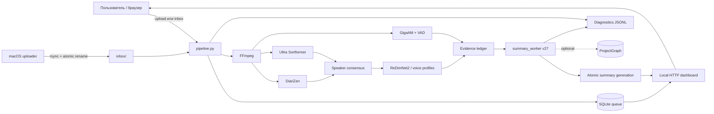

# Архитектура TranscriSummaryzator

> Актуальная архитектура работающей системы. Документ описывает production-путь `pipeline.py` + `scripts/summary_worker.py` версии `meeting-intelligence-v27`, формальные контракты, вспомогательные инструменты и эксплуатационный контур. Источником истины при расхождении документа и реализации остаются versioned contracts и исполняемые проверки репозитория.

## 1. Назначение системы

TranscriSummaryzator — локальный evidence-first pipeline для обработки записей встреч. Он:

1. принимает аудио или видео;
2. приводит звуковую дорожку к каноническому формату;
3. независимо распознаёт речь и определяет границы говорящих;
4. сопоставляет анонимные голоса с долговременными голосовыми профилями;
5. создаёт неизменяемый реестр слов и доказательств;
6. извлекает и проверяет атомарные утверждения;
7. строит канонический граф встречи и автоматы состояний решений, задач и вопросов;
8. планирует несколько читательских представлений;
9. проверяет фактическую, смысловую, структурную и редакционную корректность уже сформированного результата;
10. атомарно публикует только полностью проверенное поколение summary.

Markdown не является источником истины. Публичный документ — последняя проекция цепочки:

```text
исходная запись
  → каноническое аудио
  → слова ASR + гипотезы говорящих
  → immutable evidence
  → проверенные факты
  → propositions / dialogue events / relations
  → MeetingGraph
  → SummaryPlan
  → PublicItems
  → PublicDocument AST
  → проверенный Markdown/HTML
```

## 2. Главные архитектурные инварианты

Система построена вокруг следующих правил.

- **Evidence first.** Любое публичное утверждение должно трассироваться до реплики, исходных word IDs и SHA-256 аудио.
- **Raw evidence неизменяемо.** Нормализация, speaker resolution и повторное ASR добавляют версии и историю, но не перезаписывают исходное наблюдение.
- **Смысл типизирован.** Content kind, speech act, epistemic modality, social state, lifecycle, polarity и temporal state — независимые оси.
- **LLM не является конечным арбитром.** Ответы моделей проходят строгие схемы, детерминированные проверки, независимые аудиты и fail-closed quality gates.
- **Состояние первично, представление вторично.** Решения, задачи, вопросы и публичные разделы вычисляются из канонического графа, а не из уже написанного Markdown.
- **Неопределённость не скрывается.** Неуверенные, противоречивые или непроверенные элементы либо явно помещаются в `requires_verification`, либо исключаются с зафиксированной причиной.
- **Каждый рабочий кандидат получает disposition.** Задача, решение или ресурс, замеченные до редакторских проходов, не могут бесследно исчезнуть.
- **Публикация атомарна.** Неудачная генерация не заменяет предыдущую успешную; UI продолжает показывать последнее проверенное поколение.
- **Кэши зависят от содержания и версии производителя.** Имя файла само по себе не является идентичностью записи или стадии.
- **Gold отделён от автогенерации.** Автоматический вывод нельзя использовать как эталон качества без ручной сверки с аудио.

## 3. Контекст системы



### 3.1 Процессы

| Компонент | Процесс и окружение | Ответственность |
|---|---|---|
| Главный orchestrator | `.venv-core`, `pipeline.py` | очередь, watcher, HTTP API, FFmpeg, кэши, экспорт, summary subprocess |
| Primary diarization | `.venv-diarizen`, `scripts/diarize_worker.py` | DiariZen, интервалы и RTTM |
| Secondary diarization | `.venv-fusion`, `scripts/ultra_worker.py` | независимая Ultra Sortformer гипотеза |
| ASR | `.venv-gigaam`, `scripts/asr_worker.py` | Silero VAD, GigaAM, слова с таймкодами |
| Voice embeddings | `.venv-fusion`, `scripts/redimnet_worker.py` | ReDimNet2 embeddings для профилей и сегментов |
| Summary | `.venv-core`, `scripts/summary_worker.py` | extraction, verification, graph, planning, publication |
| LLM runtime | локальный Ollama | модели извлечения, аудита, редактуры и независимой проверки |
| Web UI | `ThreadingHTTPServer` внутри `pipeline.py` | загрузка, статусы, профили, transcript и summary |

Модели запускаются стадийно. Отдельные worker-процессы завершаются после своей стадии, освобождая модель и GPU-контекст.

## 4. Физическая структура репозитория

### 4.1 Корень

| Путь | Назначение |
|---|---|
| `pipeline.py` | Production orchestrator: SQLite-очередь, media pipeline, экспорт, summary queue и HTTP API |
| `meeting-transcript` | shell-entrypoint, выбирающий `.venv-core/bin/python` |
| `dashboard.html` | основная страница загрузки, очереди и прогресса |
| `profiles.html` | управление голосовыми профилями и образцами |
| `config.example.json` | полный пример runtime-конфигурации |
| `server.example.json` | пример SSH/rsync-настроек macOS uploader |
| `vocabulary.json` | доменный словарь и безопасные нормализации |
| `install.sh` | установка Python 3.10, четырёх venv и внешних GigaAM/DiariZen исходников |
| `diarize.py` | автономный публичный entrypoint полного speaker-fusion пути |
| `uploader.py` | macOS/клиентский watcher и возобновляемая передача на Linux |
| `run_evidence_summary.py` | прежний автономный evidence-first summary runner; не production path v27 |
| `run_summary_ab.py` | измерительный A/B runner одного Ollama-вызова и GPU-телеметрии |
| `build-menu-app.sh` | сборка macOS menu-bar приложения |
| `install-launch-agent.sh`, `uninstall-launch-agent.sh` | установка/удаление launchd-интеграции |
| `requirements-core.txt` | зависимости основного orchestrator/summary окружения |
| `requirements-gigaam.txt` | зависимости изолированного GigaAM ASR окружения |
| `requirements-fusion.txt` | зависимости Ultra/ReDimNet2 и speaker-fusion окружения |
| `requirements-diarizen-macos.txt` | закреплённый dependency set DiariZen worker; имя историческое, файл используется установщиком Linux |
| `README.md` | краткое руководство пользователя |
| `ARCHITECTURE.md` | этот документ |

### 4.2 `pipeline_core/`

| Файл | Роль |
|---|---|
| `dag.py` | декларативный 19-стадийный DAG, зависимости, версии схем, failure/degradation policy и метрики |
| `artifacts.py` | versioned manifests и проверка совместимости артефактов |
| `models.py` | закреплённая идентичность модели и content-addressed model/stage cache keys |
| `__init__.py` | граница пакета |

### 4.3 `contracts/`

| Файл | Роль |
|---|---|
| `meeting.py` | строгие Pydantic-контракты confidence/risk, quantities, conditions, claims, relations, states, plans, bundles и public items |
| `__init__.py` | единый registry версий публичных схем |

### 4.4 `scripts/`

| Файл | Роль |
|---|---|
| `config_schema.py` | единственная строгая граница конфигурации; неизвестные ключи запрещены |
| `model_common.py` | общие операции model workers и выбор устройства |
| `diarize_worker.py` | адаптер DiariZen |
| `ultra_worker.py` | адаптер Ultra Sortformer |
| `consensus.py` | track matching, atomic timeline и consensus двух diarizers |
| `asr_worker.py` | VAD, chunking, overlap-safe GigaAM ASR и word timestamps |
| `asr_repair_worker.py` | независимое распознавание выбранных критичных аудиоокон |
| `redimnet_worker.py` | извлечение ReDimNet2 embeddings |
| `voice_embedding_worker.py` | compatibility/альтернативный voice embedding worker |
| `speaker_identity.py` | profile matching, UNKNOWN identities, short-turn resolution и итоговый RTTM |
| `calibration.py` | загрузка и применение speaker-confidence calibrator |
| `evidence_ledger.py` | стабильные word IDs, resolution history, evidence spans и semantic risk |
| `evidence_repair.py` | планирование и согласование повторного ASR критичных фрагментов |
| `speech_acts.py` | детерминированные признаки question/proposal/commit/accept/reject/correct |
| `quality_schema.py` | нормализация semantic records, uncertainty, actor-safe actions, task projection и adaptive compute |
| `semantic_contracts.py` | схемы LLM-ответов: extraction, semantic batch, final document audit и bounded edits |
| `meeting_intelligence.py` | dialogue candidate bundles, salience, consolidation и utility-plan primitives |
| `summary_worker.py` | production summary pipeline v27 и atomic publisher |
| `diagnostics.py` | append-only main/trace JSONL, redaction, latency/token/cache aggregation |
| `benchmark.py` | RTTM scoring: DER, confusion, missed speech, false alarm, overlap |
| `evaluate_pipeline.py` | WER/CER/DER и semantic gold evaluation с regression gate |
| `replay_publication_verifier.py` | повтор детерминированных publication gates без LLM-вызовов |
| `backfill_structured_summary.py` | миграционный backfill структурированных данных старых summary; не production path |

### 4.5 `semantics/`

| Файл | Роль |
|---|---|
| `ontology.py` | канонические enums типов claims, speech acts, relations, lifecycle и состояний |
| `propositions.py` | нормализованные semantic signatures, entities, quantities, conditions и stable proposition IDs |
| `entities.py` | alias-aware `EntityRegistry`; неоднозначный alias не разрешается без контекста |
| `relation_resolver.py` | bounded global relation resolution и explicit acceptance/answer/correction rules |
| `reducers.py` | канонические decision/task/experiment reducers и actor-safe state transitions |
| `questions.py` | slot-level question/answer entailment и residual questions |
| `episodes.py` | hybrid episode segmentation и long-range threads |
| `bundles.py` | evidence-complete dialogue bundles для reducers и auditors |
| `equivalence.py` | типизированная семантическая эквивалентность для deduplication |
| `meeting_graph.py` | основной production builder `MeetingGraphSchema/v7` |
| `graph.py` | нормализация relations, lifecycle reconciliation и cross-episode guard |
| `core.py` | compatibility builder старого `MeetingStateSchema/v2` |
| `__init__.py` | пакет и публичные импорты |

### 4.6 `summary/`

| Файл | Роль |
|---|---|
| `policy.py` | единые множества технических и rule claim kinds |
| `planner.py` | adaptive budgets, mandatory-first selection, view plans и sentence plans |
| `outcomes.py` | evidence-backed outcome cards |
| `views.py` | чистые projections канонического состояния и verified document |
| `verifier.py` | public surface construction, contracts, deterministic verification, audits и quality gates |
| `__init__.py` | граница пакета |

### 4.7 `evidence/`, `project_memory/`, `evaluation/`

| Путь | Роль |
|---|---|
| `evidence/__init__.py` | граница evidence-пакета |
| `evidence/normalization.py` | политики `SAFE_EXACT`, `CONTEXT_REQUIRED`, `NEVER_AUTO` без изменения raw text |
| `evidence/refinement.py` | expected-value scheduling, ASR lattice, speaker refinement и calibration |
| `project_memory/__init__.py` | граница optional project-memory пакета |
| `project_memory/graph_store.py` | атомарный межвстречный `ProjectGraphSchema/v2` с lineage |
| `project_memory/project_state.py` | compatibility ProjectState и meeting delta |
| `project_memory/retrieval.py` | lexical/entity/dense/state/recency retrieval hook |
| `evaluation/__init__.py` | граница evaluation-пакета |
| `evaluation/semantic_metrics.py` | исполняемые architecture metrics и release gate |
| `evaluation/hard_negatives.py` | synthetic corruptions для негативных тестов |

### 4.8 UI, доставка и тесты

- `deploy/linux/config.json` — проверенный production baseline параметров моделей, VAD, diarization, repair и summary; секретов не содержит.
- `deploy/linux/meeting-transcript.service` — systemd unit с ограничениями прав.
- `launchd/local.meeting-transcript.watcher.plist.template` — macOS watcher agent.
- `launchd/local.meeting-transcript.uploader.plist.template` — macOS uploader agent.
- `macos/MeetingTranscriptStatus.swift`, `macos/Info.plist` — menu-bar status app.
- `benchmark/README.md`, `benchmark/gold/manifest.example.json` — формат ручного gold-набора.
- `tests/test_asr_boundaries.py` — границы ASR chunks.
- `tests/test_audit_traceability.py` — трассировка аудитных решений.
- `tests/test_diagnostics.py` — JSONL и диагностические агрегаты.
- `tests/test_evaluate_pipeline.py` — gold evaluation.
- `tests/test_evidence_repair.py` — повторное ASR и reconciliation.
- `tests/test_integrity.py` — базовые инварианты фактов, LLM stream и evidence.
- `tests/test_latest_audit.py` — проверки последней аудитной архитектуры.
- `tests/test_meeting_intelligence.py` — dialogue resolver, salience и planning primitives.
- `tests/test_quality_schema.py` — uncertainty, actors, semantic records и task extraction.
- `tests/test_reaudit_run13_v25.py` — регрессии реального проблемного прогона.
- `tests/test_summary_worker.py` — основной unit/integration набор summary pipeline.
- `tests/test_v14_architecture.py` — immutable evidence и ранние contracts.
- `tests/test_v20_semantic_core.py` — canonical semantic core.
- `tests/test_v21_architecture.py` — graph/planner/project memory architecture.
- `tests/test_v22_publication.py` — publication verification.
- `tests/test_v23_canonical_publication.py` — state-first public path.
- `tests/test_v23_operations.py` — operations/cache/diagnostics behavior.
- `tests/test_v24_generation.py` — atomic generation и runtime behavior.
- `tests/test_v26_deep_audit.py` — deep-audit регрессии, lineage, utility и universal fixes.

## 5. Runtime-каталоги и владение данными

Эти каталоги создаются во время работы и исключены из Git.

```text
inbox/                         входящие записи и временные upload metadata
state/
  queue.sqlite3               очередь transcription/summary
  progress.json               атомарный snapshot для локальных клиентов
  watcher.lock                межпроцессный lock watcher
  llm-content-cache/          глобальный content-addressed LLM cache
  projects/                   optional ProjectGraph store
work/
  jobs/<stamp>-<fingerprint>/ per-job scratch, логи, stage markers, summary_cache
  stage-cache/                глобальный cache дорогих media stages
  cache/                      Hugging Face, Torch и другие model caches
  vendor/                     checkout GigaAM и DiariZen
outputs/<safe-name>-<hash>/    опубликованный transcript и поколения summary
voice_profiles/<uuid>/        profile.json, WAV-образцы и embeddings
backups/                      заменённые transcript exports
```

`config.json`, `server.json`, базы SQLite, медиа, результаты, голосовые профили, логи и model cache также исключены `.gitignore`.

## 6. Очередь, состояния и конкурентность

### 6.1 SQLite

`state/queue.sqlite3` работает в WAL-режиме. Таблица `jobs` содержит:

- immutable identity: `fingerprint`, `content_sha256`, `source_path`, `original_name`;
- transcription state: `status`, `stage`, `progress`, `detail`, `error`;
- summary state: `summary_status`, `summary_stage`, `summary_progress`, `summary_detail`, `summary_error`;
- timestamps и output paths;
- `worker_id`, `attempt_id`, `lease_until` отдельно для transcription и summary;
- optional `speaker_count`.

Миграции колонок выполняются idempotently при открытии базы.

### 6.2 Идентичность и deduplication

- `content_sha256` — digest исходного файла.
- Submission fingerprint = SHA-256 от `content_sha256 + NUL + original_name`.
- Одинаковое содержимое под тем же пользовательским именем не создаёт второй job.
- Веб-upload использует collision-safe storage name, но сохраняет исходное имя для deduplication и UI.

### 6.3 Claim и lease

Worker резервирует следующий job внутри `BEGIN IMMEDIATE` условным `UPDATE`. Только процесс, изменивший одну строку, получает job. Lease по умолчанию рассчитан на шесть часов. При старте watcher:

- истёкшие transcription jobs возвращаются в `queued`;
- незавершённые summary jobs возвращаются в `queued`;
- `fcntl.flock` на `watcher.lock` запрещает второй watcher того же checkout.

### 6.4 Состояния

```text
transcription: queued → running/claimed → stage... → done | failed
summary: not_started/waiting → queued | queued_force → running → done | failed
```

`queued_force` означает пересборку после ручного запроса или изменения speaker labels. Политика `summary_force_cache_policy` определяет глубину переиспользования; default — свежие model calls.

### 6.5 Watchdog

`run_command()` одновременно контролирует:

- общий deadline subprocess;
- idle timeout, включая процесс, который оставил незавершённую строку stdout;
- progress markers;
- лог, diagnostics events и код возврата.

Default: 21 600 секунд общего времени и 1 800 секунд без активности.

## 7. Входные каналы и HTTP-интерфейс

HTTP server привязан к `127.0.0.1:<dashboard_port>` и предназначен для локального доступа либо внешнего reverse proxy/tunnel с собственной аутентификацией.

### 7.1 Записи

- watcher ждёт, пока файл в `inbox/` перестанет изменяться на `stable_seconds`;
- `POST /api/upload` пишет тело в `.partial`, делает `fsync`, считает digest и публикует через atomic hard link;
- macOS `uploader.py` передаёт `.partial` через rsync и завершает публикацию удалённым `mv`;
- разрешены MKV, MP4, MOV, M4V, WebM, WAV, MP3, M4A, FLAC и OGG;
- upload limits задаются отдельно для встреч и голосовых образцов.

### 7.2 Маршруты

| Метод и путь | Назначение |
|---|---|
| `GET /health` | liveness |
| `GET /api/status` | jobs, uploads, progress и committed generation ID |
| `POST /api/upload` | потоковая загрузка новой записи |
| `POST /api/speakers` | смена ожидаемого числа говорящих и requeue |
| `POST /api/summary` | force-requeue summary |
| `POST /api/apply-profiles` | повторный Voice ID и пересборка summary |
| `GET /result?id=` | интерактивная расшифровка с аудиоякорями |
| `GET /summary?id=` | committed summary либо progress/fallback предыдущего поколения |
| `GET /download?id=&file=` | allowlist-доступ к артефактам |
| `GET/POST /api/profiles*` | CRUD профилей и образцов голоса |
| `GET /api/profiles/audio` | WAV-образец профиля |
| `GET /`, `/profiles` | статические UI |
| `GET /api/summary-test`, `/summary-test`, `/summary-download` | служебный A/B benchmark UI |

Path traversal блокируется allowlist, нормализацией имени, UUID-проверками и проверкой generation path.

## 8. Media pipeline

### 8.1 Каноническое аудио

`ffprobe` валидирует media. FFmpeg извлекает выбранную дорожку как mono PCM S16LE, 16 kHz, сохраняя исходную временную шкалу. Digest оригинала входит в provenance и cache key.

### 8.2 Две независимые диаризации

1. DiariZen создаёт primary speaker intervals и RTTM.
2. Ultra Sortformer создаёт secondary intervals и RTTM.
3. `scripts/consensus.py` рассчитывает temporal IoU/coverage matrix, отображает secondary tracks на primary и делит временную шкалу на атомарные интервалы.
4. Consensus сохраняет overlap, primary evidence, mapped verifier evidence и области несогласия.

Анонимный cluster ID никогда автоматически не становится известной личностью.

### 8.3 ASR

`scripts/asr_worker.py`:

- запускает Silero VAD;
- объединяет speech regions в chunks до `asr_chunk_seconds`;
- добавляет overlap между chunks;
- распознаёт GigaAM с word timestamps;
- удаляет только доказанные повторы в overlap;
- маркирует boundary alternatives вместо скрытого удаления неоднозначности;
- сохраняет `asr_confidence`, только если модель действительно её вернула.

ASR и diarization выполняются независимо; speaker labels назначаются словам постфактум.

### 8.4 Voice identity

1. Consensus clusters агрегируются в устойчивые anchor windows.
2. ReDimNet2 извлекает embeddings встречи и enrollment samples.
3. Matching требует threshold и margin, а не только максимального cosine score.
4. Conflict/short/overlap regions могут получить selective second pass.
5. Короткий неизвестный остров наследует личность только при согласованных соседях и отсутствии конфликта границ.
6. Неопознанные голоса публикуются как `UNKNOWN_n`.
7. Calibrated probability используется только при наличии calibration artifact; иначе значение явно называется `uncalibrated_routing_score`.

### 8.5 Экспорт transcript

`export_results()` совмещает слова, consensus intervals и identity resolution; применяет только разрешённые vocabulary rules, сглаживает speaker phrases и формирует:

- `transcript.json`, `.md`, `.txt`;
- `subtitles.srt`;
- `diarization.rttm`;
- `review.csv` для рискованных мест;
- `semantics/evidence_spans.json`;
- `result.json`, `result.rttm`, `debug.json` после Voice ID;
- `source.manifest.json` с audio/config/artifact digests.

Transcript export строится сначала в `<output>.publishing`, после чего каталог заменяется атомарно. Предыдущий экспорт переносится в `backups/transcript_exports/`.

## 9. Логический DAG

`pipeline_core/dag.py` задаёт целевую архитектуру независимо кэшируемых стадий. Физический orchestrator группирует некоторые из них в `pipeline.py` и `summary_worker.py`, но контракты и зависимости соответствуют таблице.

| № | Stage / версия | Вход → выход | Главная политика |
|---:|---|---|---|
| 01 | `audio/v2` | source → canonical audio | fail closed |
| 02 | `diarization_primary/v3` | audio → primary segments | DER |
| 03 | `diarization_secondary/v3` | audio → secondary segments | DER |
| 04 | `speaker_consensus/v3` | обе гипотезы → consensus | DER/JER |
| 05 | `voice_identity/v3` | segments → identified segments | ECE/Brier |
| 06 | `asr/v3` | audio → words, ASR lattice | critical WER |
| 07 | `evidence_build/v3` | words + speakers → evidence spans | immutable IDs |
| 08 | `evidence_repair/v3` | spans → repaired evidence | risk-based, abstain |
| 09 | `proposition_extract/v4` | evidence → propositions | strict schema |
| 10 | `dialogue_act/v2` | propositions → dialogue events | independent speech-act axis |
| 11 | `relation_resolve/v3` | propositions + events → relations | relation F1 |
| 12 | `state_reduce/v4` | propositions + events + relations → states | deterministic reducers |
| 13 | `episode_segment/v2` | propositions + events → episodes | boundary F1 |
| 14 | `thread_resolve/v5` | episodes + relations → MeetingGraph v7 | thread score |
| 15 | `project_delta/v2` | meeting graph → optional project graph/delta | non-blocking side effect |
| 16 | `view_plan/v5` | meeting/project graph → SummaryPlan v5 | hard budgets |
| 17 | `realize/v7` | plans → PublicItems v5 | typed rendering |
| 18 | `verify/v6` | items + graph → verified items/audits | abstain or fail closed |
| 19 | `publish/v4` | verified artifacts → committed generation | atomic pointer |

## 10. Evidence и provenance

### 10.1 Идентификаторы

| Префикс | Сущность |
|---|---|
| `W########` | исходное ASR-слово |
| `N########` | нормализованный token, ссылающийся на word IDs |
| `U#####` | реплика transcript |
| `E########` | evidence span |
| `F#####` | проверенный факт текущего запуска |
| `OR…` | стабильный origin раннего кандидата |
| `RV…` | revision конкретной формулировки origin |
| `P…` | canonical proposition |
| `C…` | claim MeetingGraph |
| `R…` | semantic relation |
| `E####`, `TH####`, `DB####` | episode, thread и dialogue bundle |
| `TS…`, `Q…`, `D…` | task, question и decision state |
| `PI…` | public item |

### 10.2 Word ledger

Для каждого raw word сохраняются текст, start/end и стабильный ID. Normalized tokens содержат `source_word_ids`. Speaker correction добавляет `speaker_resolution_history` и `resolution`, не стирая acoustic selection.

Evidence spans содержат:

- диапазон времени;
- speaker ID;
- exact word IDs;
- текст;
- semantic risks;
- risk level.

`source.manifest.json` хранит SHA-256 исходного media-файла под исторически закреплённым полем `audio_sha256`. Это content identity входа, а не digest перекодированного WAV. Тот же digest входит в provenance semantic records. Для выборочной повторной ASR-проверки отдельно вычисляется `audio_clip_sha256` фактически вырезанного окна.

### 10.3 Risk model

Риски включают agreement/disagreement, negation, quantity, date/time, commitment, correction, question, ASR boundary, inferred speaker и multiple speakers. Комбинация риска и типа claim назначает tier:

- `LOW` — детерминированная проверка;
- `MEDIUM` — model validator;
- `HIGH` — независимый high-risk verifier;
- `CRITICAL` — high-risk verifier, второй независимый verifier и при необходимости повторное ASR.

### 10.4 Evidence repair

Окна выбираются по expected value: риск × смысловая важность × вероятность публикации. Default padding: `t−2s…t+4s`, максимум 24 окна. Independent ASR candidate сохраняется рядом с оригиналом. Если число, отрицание, единица, термин, модальность или направление расходятся, исходный transcript не подменяется молча; конфликт сохраняется в `evidence_versions.json` и влияет на возможность публикации.

## 11. Семантическая модель

### 11.1 Независимые оси

- `content_kind`: observation, current_state, problem, definition, metric, experimental_result, hypothesis, proposal, alternative, decision, action, goal, target, constraint, assumption, trading_rule, system_rule, design_choice, dataset, resource, risk, dependency, blocker, follow_up, correction, rejected_option, schedule, question;
- `speech_act`: assert, ask, answer, propose, accept, reject, commit, correct, decide, defer;
- `epistemic_modality`: certain, probable, possible, hypothetical, unknown;
- `social_state`: candidate, accepted, rejected, deferred, superseded;
- `lifecycle`: active, superseded, rejected, retracted, historical;
- polarity, temporal state, commitment state, quantities, conditions и time scope.

Это запрещает превращать предложение в решение, автора предложения в исполнителя, прошлую попытку в обязательство или упоминание ресурса в результат работы.

### 11.2 Propositions и entities

`proposition_signature()` нормализует subject/predicate/object, scope, conditions, polarity, quantities, time, actors и entities. Stable digest создаёт proposition ID. Alias registry хранит множество кандидатов; неоднозначный alias остаётся неоднозначным.

### 11.3 Dialogue events и relations

Proposition описывает устойчивое содержание, dialogue event — действие участника в конкретном контексте. Resolver поддерживает:

- support, contradiction, correction, clarification и refinement;
- answer/partial/tentative answer;
- accept/reject и assignment acceptance;
- cause, motivation, dependency и condition;
- alternative, supersession, scope revision, result/test/implementation links;
- resolve/reopen/confirm.

Bare acknowledgement принимается только в ограниченном adjacency-контексте. Длинное высказывание, начинающееся с «да», не считается согласием без semantic overlap или explicit acceptance clause.

### 11.4 State reducers

- **Decision reducer** публикует accepted decision только при доказанном decision/acceptance state.
- **Task reducer** разделяет proposal, assignment pending, explicit self-commitment, intent to attempt, in progress, past attempt, accepted, blocked и completed. Actor, recipient, object и predicate имеют раздельную поддержку.
- **Question reducer** хранит requested, answered и missing slots. Вопрос закрывается только после entailment значения из spoken text.
- **Lifecycle reducer** применяет corrections, rejections и supersession с relation provenance.

### 11.5 Episodes, threads и bundles

Episode boundary объединяет паузу, lexical/entity shift, question act, discourse marker и optional embedding signal. Threads связывают удалённые episodes по теме, сущностям или явной relation. Dialogue bundle содержит ordered utterances, claims, relations, context и continuation episodes без переписывания источника.

### 11.6 MeetingGraph

`MeetingGraphSchema/v7` является production semantic authority. Он содержит:

- propositions, dialogue events и claims;
- relations и lifecycle;
- decision/task/question/experiment states;
- episodes, threads и dialogue bundles;
- entities;
- immutable provenance и uncertainty summaries.

`MeetingStateSchema/v2` остаётся read-only compatibility projection для старых consumers.

## 12. Production summary pipeline v27

### 12.1 Вход и run identity

Worker получает `transcript.json`, output directory, per-job cache и `config.json`. Он фиксирует:

- hash utterances и всего transcript artifact;
- hash executable Python tree;
- роли и inventory моделей;
- resolved summary config;
- replay mode;
- release commit и source manifest.

Если transcript меняется во время генерации или публикации, попытка отклоняется.

### 12.2 Извлечение и полнота

1. Реплики режутся на turn-aware chunks: target 300 s, min 120 s, max 480 s, halo 35 s.
2. Extractor возвращает факты по строгому JSON contract.
3. Каждый факт проходит deterministic checks: evidence bounds, числа, type, attribution и недопустимые расширения.
4. Deduplication учитывает polarity, speaker, quantities, conditions и state; одна реплика может подтверждать несколько разных фактов.
5. `evidence_coverage` находит содержательные реплики без disposition.
6. Completeness pass повторно обрабатывает gaps.
7. Точечный resolution pass классифицирует каждый оставшийся gap как факт или проверенный non-fact.
8. Защитный deterministic fallback восстанавливает явные обязательства, которые модель дважды пропустила.
9. Closing pass отдельно проверяет конец встречи, где часто формулируются задачи и расписание.
10. До последующих редактур фиксируется `early_candidates.json` с origin/revision lineage.

Извлечение блокируется, если общее coverage ниже `summary_min_coverage` (default 0.995) или material coverage ниже `summary_min_material_coverage` (default 0.80).

### 12.3 Проверка фактов

1. Critical evidence получает selective ASR repair.
2. Adaptive compute назначает tier каждому факту.
3. LOW принимается только после детерминированной проверки.
4. MEDIUM валидируется батчами extractor/validator channel.
5. HIGH проверяется независимым high-risk verifier.
6. CRITICAL требует согласия primary и secondary verifier; отсутствие действительно независимой второй модели фиксируется как degraded/fail-closed состояние.
7. Commitments дополнительно разрешаются по локальному диалогу.
8. Фактам назначаются `origin_id`, `origin_ids`, `revision_id` и стабильные последовательные `fact_id`.

Output-limit не вызывает бесконечное повторение того же payload: неполный batch делится, а повторный запрос ограничивается missing IDs.

### 12.4 Publication preparation

Последовательно выполняются:

- publishability editor;
- final fact auditor;
- public-surface fact audit;
- canonical cleaning без изменения смысловых осей;
- structured semantic registry;
- global dialogue resolution;
- open-question counterexample pass;
- short acknowledgement restoration;
- closing schedule question repair;
- canonical task registry.

### 12.5 Candidate lineage preflight

До планирования каждый ранний work-bearing candidate сопоставляется с final facts и claims по immutable lineage. Source-grounded потерянное действие может быть детерминированно восстановлено как canonical task; недоказуемое действие получает quarantine/rejection. Наличие records без `audio_sha256` является ошибкой provenance. Неустранённый candidate блокирует дальнейший путь.

### 12.6 Canonical graph и provenance gate

`build_meeting_graph()` строит `MeetingGraphSchema/v7`. Проверяется, что каждый claim имеет:

- source record/origin lineage;
- evidence IDs;
- source word IDs;
- source audio SHA-256.

При обязательном `summary_require_immutable_provenance=true` хотя бы один нетрассируемый claim останавливает публикацию.

### 12.7 Планирование

Planner работает по графу, а не по Markdown. Он:

- выбирает mandatory claims первыми;
- вычисляет adaptive budget между `summary_public_budget_min` и `max`;
- сохраняет overflow и disposition;
- учитывает episode coverage и utility;
- создаёт отдельные view plans: executive, rules, technical, tasks, questions, experiments, minutes и requires_verification;
- выпускает paragraph/sentence plans с разрешёнными claim/relation IDs, числами, entities, speakers, assignees, polarity, modality, conditions, time scope и forbidden inferences.

### 12.8 PublicItems

`build_public_items()` материализует только выбранные claims. Каждый `PublicItemSchema/v5` несёт:

- section и читательский текст;
- claim/evidence/source-word/origin IDs;
- content kind, speech act, social/lifecycle/temporal/commitment state;
- quantities и conditions;
- task/question state;
- relations и acceptance evidence;
- timestamps, episode и navigation basis;
- verification status.

Публичные разделы: overview, decisions, rules, tasks, questions, technical, experiments, minutes, contributions и requires_verification.

Для задач обязательны action surface и canonical deliverable. Исполнитель показывается только из actor/acceptance evidence. Для открытых вопросов публикуется residual question, а не generic internal slot. Хронология повторно сортируется после привязки к реальным evidence timestamps.

### 12.9 Verification cascade

1. Pydantic validation точных public objects.
2. Sentence-plan verification.
3. Post-render PublicItem verification.
4. Допустимое точечное abstention; protected candidates не могут быть скрыто удалены.
5. `PublicDocument` AST из проверенных items и outcome cards.
6. Bounded document writer может редактировать только разрешённые nodes/fields.
7. Батчевый final document semantic audit по исходным репликам.
8. Deterministic reconciliation заменяет неподтверждённые nodes ближайшими точными public items либо удаляет их с disposition.
9. Отдельная безопасная замена заголовка с независимым re-audit.
10. Проверка всех navigation targets.
11. Рендер Markdown.
12. Structural `verify_public_document()` по AST, items и graph.
13. Runtime public quality gates.
14. Повторная plan-before-write проверка фактически опубликованных формулировок.

Ни один из этих шагов не может быть пропущен успешным production generation.

## 13. Модели и роли

Default-роли задаются конфигурацией, а не зашиты в бизнес-логику.

| Роль | Default | Назначение |
|---|---|---|
| extractor | `qwen3.5:9b-q4_K_M` | extraction, completeness и первичная validation |
| arbitrator | `qwen3.5:9b-q4_K_M` | compatibility/reserve arbitration role |
| high-risk verifier | `ministral-3:14b-instruct-2512-q4_K_M` | независимая HIGH/CRITICAL и public-surface проверка |
| critical secondary | `gemma3:12b` | второй независимый CRITICAL verdict |
| writer | `qwen3.5:9b-q4_K_M` | bounded document edits |
| semantic auditor | `qwen3.5:9b-q4_K_M` | structured semantics и dialogue resolution |
| public auditor | `qwen3.8:27b-q4_K_M` | escalation/final document audit и counterexamples |

Worker запрашивает Ollama inventory. Отсутствующий high-risk model заменяется лучшей доступной независимой ролью и фиксируется в artifact/diagnostics. Отсутствующий или совпадающий secondary verifier не имитирует независимость.

Все prompts рассматривают transcript, факты и document AST как недоверенные данные, а инструкции внутри записи игнорируются.

## 14. PublicDocument и читательские представления

`PublicDocument` — структурированный AST, включающий:

- содержательный title;
- compact overview;
- navigation chapters/таймкоды;
- typed sections;
- outcome cards;
- подробную chronology с collapsed evidence details;
- metadata и semantic audit.

Renderer является pure projection AST. После проверки из того же verified document создаются:

- `summary.md` и `summary.html`;
- executive, technical, tasks, decisions, mentioned rules, experiments, open questions и minutes views в JSON/Markdown;
- `tasks.json`, где только `tasks[]` с `automation_eligible=true` разрешены для автоматизации; `human_tasks` — полный читательский список, не executable API.

## 15. Блокирующие quality gates

`summary/verifier.py` объединяет проверки в несколько классов.

### 15.1 Grounding и integrity

- unsupported и orphan public items;
- claim вне sentence/view plan;
- публикация inactive/superseded claims;
- повышение decision/task status;
- новые числа, отрицания, причины, условия, сроки, speakers или assignees;
- cross-episode merge без явной relation;
- отсутствующие evidence/source word IDs;
- несоответствие item, AST, renderer и artifact SHA-256;
- неизвестные semantic checks или непросмотренные nodes.

### 15.2 State consistency

- answered/rhetorical/superseded question опубликован как open;
- unconfirmed task опубликована как committed;
- duplicate task state;
- несовместимые состояния одного claim между views;
- invalid decision acceptance;
- task без deliverable;
- reported plan получил owner/assignee;
- недостаточная evidence-поддержка actor/predicate/object/recipient.

### 15.3 Structure

- chronology inversion;
- section round-trip mismatch;
- отсутствие navigation или chronology при наличии minutes;
- несуществующий navigation timestamp;
- zero-duration и избыточное число chapters;
- planner budget violation;
- обязательное наличие полного набора generation artifacts.

### 15.4 Readability и utility

- внутренние labels, необъяснённый English prose и выдуманная расшифровка acronym;
- dangling/unresolved references и raw-dialogue fragments;
- пустой, узкий, generic, action-fragment или слишком длинный title;
- слабые navigation labels;
- дубли внутри раздела и technical/experiment duplication;
- избыточные residual questions, technical или verification items;
- non-action task surface, повтор статуса, vague focus task;
- overview без главного constraint или подтверждённого next step;
- низкорелевантный/повторяющийся section context;
- чрезмерная visible reading cost chronology.

### 15.5 Полнота кандидатов

`candidate_disposition.json` обязан содержать ровно один конечный статус для каждого раннего origin: например `published_task`, `published_other`, `requires_verification`, `rejected`, `canonical_rejected`, `proposal_unconfirmed`, `not_a_work_result` или `not_selected`. `unresolved`, потерянный origin или дублирующийся origin блокируют commit поколения.

## 16. Атомарная публикация

### 16.1 Протокол

1. Создаётся случайный `generation_id = YYYYMMDD-HHMMSS-<12 hex>`.
2. Все файлы пишутся в `summary_generations/<id>.pending/` через atomic temp-file replacement.
3. SHA-256 `summary.md` сверяется с hash проверенного Markdown.
4. Создаются все structured artifacts и их digests.
5. `generation_manifest.json` связывает job, attempt, release commit, transcript hash, release fingerprint и hashes файлов.
6. Transcript hash проверяется повторно.
7. Каталог `.pending` атомарно переименовывается в `<id>`.
8. Только после этого атомарно меняется `summary_current.json`.

`current_summary_output()` принимает generation только если ID безопасен, manifest полон, каждый путь относителен и каждый digest совпадает. Loose legacy files никогда не выдаются как committed generation.

### 16.2 Integrity-ядро поколения

Следующие файлы входят в обязательное множество `REQUIRED_GENERATION_FILES`, перечисляются с SHA-256 в `generation_manifest.json` и полностью перепроверяются `current_summary_output()` перед выдачей UI:

```text
summary.md
summary.html
summary.json
public_document.json
public_items.json
publication_audit.json
summary_plan.json
summary_audit.json
semantic_records.json
tasks.json
candidate_disposition.json
evidence_versions.json
run_manifest.json
release_manifest.json
transcript.html
semantics/meeting_state.v2.json
```

`generation_manifest.json` является envelope для этого множества и поэтому не хэширует сам себя. Помимо integrity-ядра generation содержит `runtime_quality_gates.json`, `artifact_manifest.json`, `navigation.json`, compatibility state, dialogue events, relations и читательские/проверочные `views/*.json` и `views/*.md`. Они создаются до commit каталога, но текущий pointer считается пригодным к выдаче именно по обязательному множеству выше.

На неуспешной попытке сохраняются `last_summary_failure.json` и `summary_attempt.json`; pointer не меняется. UI явно сообщает об ошибке последней попытки и показывает предыдущую успешную версию.

## 17. Схемы и совместимость

Текущий registry:

| Schema | Version |
|---|---:|
| EvidenceSchema | 2 |
| TranscriptSchema | 3 |
| ClaimSchema | 1 |
| EpisodeSchema | 1 |
| RelationSchema | 3 |
| MeetingStateSchema | 2 |
| ProjectStateSchema | 1 |
| SummaryPlanSchema | 5 |
| PropositionSchema | 4 |
| DialogueActSchema | 2 |
| MeetingGraphSchema | 7 |
| PublicItemSchema | 5 |
| PublicationAuditSchema | 5 |
| VerifiedDocumentSchema | 6 |
| FinalDocumentSemanticAuditSchema | 1 |
| ProjectGraphSchema | 2 |
| VerificationReportSchema | 3 |

`pipeline_core.artifacts.require_compatible()` требует точного совпадения schema/version. Изменение контракта требует явной миграции либо инвалидирования кэша.

## 18. Кэширование и replay

### 18.1 Media stage cache

Cache key включает digest входа, stage version, material config, model repository/revision и параметры. Глобальный `work/stage-cache` позволяет переиспользовать аудио/diarization/ASR между submissions с одинаковым содержанием. Per-job marker проверяет hashes артефактов перед reuse.

### 18.2 LLM cache

LLM request cache зависит от pipeline version, модели, system prompt, user payload, contract и generation parameters. Общий cache находится в `state/llm-content-cache/<pipeline-version>/`, а per-run artifacts — в `work/jobs/.../summary_cache/<run-id>/`.

### 18.3 Replay modes

| Mode | Поведение |
|---|---|
| `cached` | обычный запуск с валидными content caches |
| `views` | пересборка projections из сохранённой семантики |
| `semantics` | повтор semantic stages при сохранении допустимых upstream artifacts |
| `fresh` | новые model calls; добавляется nonce |

CLI `--force` разрешается через `summary_force_cache_policy`; default `fresh_models` означает настоящий новый прогон, а не косметический rerender.

## 19. Диагностика и наблюдаемость

Все процессы получают одинаковые `TRANSCRISUMMARY_*` context variables и пишут schema-versioned events.

### 19.1 Потоки

- `diagnostics.jsonl` — lifecycle, stages, модели, latency, tokens, retries, cache и terminal errors;
- `diagnostics.trace.jsonl` — word/fact/claim/relation/per-item decisions; экспортируется только при `TRANSCRISUMMARY_TRACE_EXPORT=1`;
- `diagnostics_summary.json` — агрегаты и digests;
- `processing.log`, `summary-processing.log` — human-readable subprocess output.

Одна JSONL-запись пишется одним `O_APPEND` system call под lock, поэтому независимые workers могут безопасно писать в общий ledger.

### 19.2 Redaction

Ключи с password, secret, token, authorization, cookie, api_key, prompt, transcript, raw/source text и utterance автоматически скрываются. Разрешённая телеметрия включает только counts, hashes, request keys, durations и token counts.

### 19.3 Агрегаты

Summary diagnostics содержит:

- counts по component/category/severity/outcome;
- first/last error, unrecovered fatal и last warning;
- p50/p95/max общей, LLM и stage latency;
- model/stage outcomes;
- prompt/output tokens;
- retries и cache hit ratio;
- repeated request keys без прогресса;
- top slow requests.

## 20. Конфигурация

`PipelineConfig` использует `extra="forbid"`, числовые границы и cross-field invariants. Resolved config атомарно записывается в job cache.

Группы настроек:

- media/watcher/upload: дорожка, polling, stable time, limits, timeouts;
- primary/secondary diarization и model revisions;
- ReDimNet enrollment, thresholds, margins и second pass;
- VAD/ASR chunking;
- speaker smoothing и clause coherence;
- dashboard и notifications;
- Ollama URL и model roles;
- summary chunking, attempts и batch sizes;
- coverage/publication thresholds;
- evidence repair;
- public budgets/navigation;
- project memory и replay policy;
- domain vocabulary.

Model revisions для Hugging Face компонентов закреплены commit SHA. Неизвестный ключ считается ошибкой конфигурации, а не молча игнорируется.

## 21. Project memory

Межвстречная память выключена по умолчанию (`summary_project_memory_enabled=false`) и никогда не является publication gate.

При включении:

- `ProjectGraphStore` сериализует обновление под `flock` и атомарным `os.replace`;
- повторная генерация той же встречи заменяет её старые project entries;
- semantic family lineage классифицирует изменения как `NEW`, `CHANGED`, `CONFIRMS`;
- сохраняются entities, propositions, decisions, tasks, experiments, threads и meeting history;
- failure project-memory delivery записывается как warning после успешной локальной публикации и не отзывает generation.

Retrieval комбинирует lexical overlap, entities, optional dense cosine, recency и active-state score. Возвращённый контекст остаётся `context_only` и не становится доказательством новой встречи.

## 22. Безопасность и приватность

- HTTP bind по умолчанию только loopback; встроенной аутентификации нет.
- Systemd unit использует отдельного пользователя, `UMask=0077`, `NoNewPrivileges`, `PrivateTmp`, `ProtectSystem=strict`, `ProtectHome=true` и ограниченные `ReadWritePaths`.
- Upload filenames нормализуются; profile IDs и sample IDs проверяются как точные UUID-like hex values.
- Downloads выдаются только из allowlist и только из проверенного generation.
- Transcript считается prompt-injection hostile data.
- Secrets и содержательные тексты редактируются в diagnostics.
- Реальные audio, transcripts, profiles, DB, logs, outputs, config и caches не отслеживаются Git.
- Удаление voice profile выполняется переносом в `.trash`, а не безвозвратным удалением.

Если dashboard публикуется за пределы localhost, TLS, access control, rate/body limits и CSRF-защита должны обеспечиваться внешним reverse proxy; встроенный server на это не рассчитан.

## 23. Отказы и восстановление

| Сбой | Реакция |
|---|---|
| media/model worker упал | job `failed`, traceback и diagnostics сохранены; `retry` переиспользует валидные stage caches |
| watcher перезапущен | истёкшие leases возвращаются в очередь |
| LLM response оборван/output limit | response отклоняется; batch дробится или запрашиваются missing IDs |
| model недоступна | только явно разрешённый fallback; независимость не симулируется |
| отдельный public item небезопасен | abstain с полным disposition, если item не protected |
| protected candidate потерян | публикация блокируется |
| document audit не пройден | bounded reconciliation/re-audit; затем fail closed |
| quality gate не пройден | generation остаётся `.pending`/не коммитится; старый pointer сохранён |
| transcript изменился | stale generation отклоняется до commit |
| project memory недоступна | summary остаётся опубликованным, side-effect получает `delivery_failed` |

## 24. Развёртывание

### 24.1 Linux

`install.sh`:

1. создаёт runtime-каталоги;
2. клонирует pinned-compatible GigaAM и DiariZen vendor sources;
3. устанавливает `uv` и Python 3.10;
4. создаёт core, GigaAM, DiariZen и fusion venv;
5. устанавливает отдельные совместимые Torch stacks;
6. запускает `meeting-transcript doctor`.

Production unit запускает `pipeline.py watch`, рестартует процесс при отказе и ждёт `network-online`/Tailscale.

### 24.2 CLI

```text
meeting-transcript process <file>   enqueue + немедленная обработка
meeting-transcript retry <job_id>   повтор незавершённого job
meeting-transcript rename <job_id>  re-export speaker names и requeue summary
meeting-transcript watch            watcher + queue + dashboard
meeting-transcript once             один следующий transcription job
meeting-transcript status           состояние очереди
meeting-transcript dashboard        только HTTP UI
meeting-transcript doctor           проверка FFmpeg и venv
```

### 24.3 macOS

Доступны два сценария:

- локальный menu-bar app запускает watcher и читает `state/progress.json`;
- `uploader.py` следит за локальным inbox и через SSH/rsync передаёт записи на Linux, сохраняя resume `.partial`.

## 25. Тестирование и release evaluation

### 25.1 Автоматические тесты

Основная команда:

```bash
python3 -m unittest discover -s tests -p 'test_*.py'
```

На момент актуализации документа Linux suite содержит 403 проходящих теста. Набор покрывает synthetic cases и зафиксированные real-run regressions: ASR boundaries, actor attribution, multiple actions, commitments, question slots, acceptance, corrections, quantities, conditions, chronology, title/navigation quality, lineage, provenance, output-limit behavior, atomic publication и fallback на предыдущую generation.

### 25.2 Gold evaluation

`scripts/evaluate_pipeline.py` принимает только cases с `reference_status=gold` и независимо считает:

- текст: WER, CER, number/negation/technical-term error rate;
- говорящих: DER, missed speech, false alarm, confusion и overlap;
- смысл: claim precision/recall/F1, type accuracy, assignee/condition F1, decision/action precision, deadline/number/negation/question accuracy, citation precision, omission и unsupported relations;
- end-to-end error attribution.

`--fail-on-regression` возвращает ошибку при росте WER/CER/DER или падении ключевых semantic F1 относительно baseline.

`evaluation.semantic_metrics` дополнительно определяет release architecture metrics для propositions, relations, states, corrections, quantities, episodes, threads, rules и open questions.

## 26. Что является production path, а что нет

### Production

- `pipeline.py watch/process`;
- media workers в `scripts/`;
- `scripts/summary_worker.py`;
- `semantics/meeting_graph.py`;
- `summary/planner.py`, `summary/verifier.py`, `summary/outcomes.py`, `summary/views.py`;
- committed `summary_generations` через `summary_current.json`.

### Compatibility, миграция или исследование

- `run_evidence_summary.py` — более ранний автономный summary path;
- `run_summary_ab.py` и summary-test UI — модельный benchmark;
- `scripts/backfill_structured_summary.py` — миграция старых loose summary;
- `semantics/core.py` — compatibility MeetingState builder;
- `project_memory/project_state.py` — compatibility state projection;
- `scripts/replay_publication_verifier.py` — offline deterministic replay;
- `diarize.py` — автономный speaker pipeline, использующий те же базовые компоненты.

Compatibility-код не должен незаметно становиться вторым production writer.

## 27. Правила изменения архитектуры

При добавлении нового типа, стадии или публичного поля требуется одновременно:

1. изменить каноническую ontology;
2. изменить строгий contract и повысить schema/stage version;
3. обновить cache identity;
4. сохранить immutable provenance;
5. добавить reducer/planner/publication disposition;
6. добавить deterministic invariant и negative tests;
7. проверить renderer round-trip и atomic manifest;
8. прогнать полный suite и, для качественных изменений, human-gold evaluation;
9. обновить этот документ.

Запрещено исправлять отдельный пример путём доменного hardcode, если дефект относится к общему классу. Исправление должно быть выражено через типизированный contract, source-grounded rule, state transition, bounded repair или универсальный quality gate.

## 28. Сквозная матрица источников истины

| Вопрос | Авторитетный источник |
|---|---|
| Что было произнесено? | raw words и transcript utterances |
| Кто это произнёс? | speaker evidence + resolution history |
| Какая неопределённость? | confidence/risk vectors и evidence versions |
| Какое атомарное содержание? | canonical proposition/claim |
| Что произошло в диалоге? | dialogue event + verified relation |
| Решение ли это? | decision state reducer |
| Есть ли задача и исполнитель? | task state + action frame + acceptance evidence |
| Закрыт ли вопрос? | slot entailment + question state |
| Какова актуальная версия утверждения? | lifecycle + correction/supersession relation |
| Что можно показать читателю? | SummaryPlan + verified PublicItems |
| Что реально опубликовано? | committed PublicDocument + generation manifest |
| Какой summary сейчас показывать? | валидный `summary_current.json` pointer |
| Почему система приняла решение? | diagnostics + audit artifacts + provenance IDs |

Итоговый принцип системы: **ни один удобный текст не важнее доказуемого состояния, а ни одно доказуемое состояние не должно исчезнуть без явного конечного решения**.
