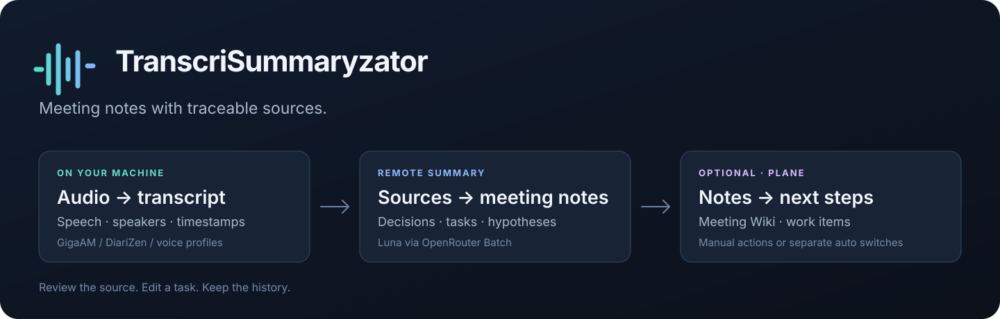

# TranscriSummaryzator

[English](README.en.md) · [Установка](docs/DOCKER.md) · [Plane](docs/PLANE.md) · [Архитектура](ARCHITECTURE.md) · [Ограничения](docs/STATUS.md)



**Записи встреч, конспекты и задачи — с переходом к исходной реплике.**

TranscriSummaryzator превращает аудио и видео встреч в расшифровку с участниками и таймкодами, затем собирает содержание, решения, задачи и гипотезы. Речевые модели работают на вашей машине. Текущий маршрут конспекта отправляет текст в Luna через OpenRouter Batch; готовые материалы можно перенести в Plane.

Проект ориентирован на русскоязычные встречи. Ошибки распознавания и пропуски модели возможны: ссылки на источник и статусы проверки помогают пересматривать результат.

## Что получается

- **Расшифровка с навигацией.** Реплики, таймкоды, разделение говорящих и сопоставление с сохранёнными голосовыми профилями.
- **Конспект с источниками.** Темы, решения, задачи и гипотезы связаны с репликами встречи; статус неполной проверки виден отдельно.
- **Редактируемые карточки.** Название, описание, исполнитель, срок и другие поля можно исправлять без новой генерации. Ревизии сохраняются, изменения попадают в конспект и экспорты.
- **Plane.** Ручная отправка отдельных задач и гипотез, отдельные переключатели автоматизации и Wiki-страница встречи.
- **Файлы и диагностика.** Расшифровка в TXT, Markdown, HTML и JSON, субтитры SRT; конспект в Markdown, HTML и JSON; журнал этапов, статусы и учёт расходов Batch.

## Быстрый старт

Основной вариант — полный Docker-профиль: загрузка записи, локальная расшифровка, конспект Luna и интеграция Plane.

**Нужно:** Linux `amd64`, NVIDIA GPU с совместимым драйвером и NVIDIA Container Toolkit, Git и Docker Compose. Предусмотрите место под образ, модели и записи; для сборки из исходников требуется не менее 60 ГБ свободного места. Подробности — в [инструкции установки](docs/DOCKER.md).

```bash
git clone https://github.com/R1venDev/TranscriSummaryzator.git && cd TranscriSummaryzator
./scripts/docker-install.sh --speech
```

Откройте [http://127.0.0.1:8765](http://127.0.0.1:8765). При первом запуске установщик выводит логин `admin` и пароль один раз — сохраните его. Без аргумента установщик также выбирает `--speech`. По умолчанию он загружает образы `speech` и `summary` из `ghcr.io/r1vendev/transcrisummaryzator`; флаг `--build` включает сборку из вашего checkout.

1. Добавьте inference-ключ OpenRouter в **Настройки → Суммаризатор → OpenRouter** (`/summary-settings`).
2. Настройте проверенный workspace и параметры доступа по [инструкции Docker](docs/DOCKER.md). Сохранение ключа само по себе не разрешает отправку стенограммы.
3. Загрузите запись через веб-интерфейс. Веса речевых моделей загрузятся в локальный кэш при первом задании. После расшифровки конспект попадает в очередь Luna.
4. Просмотрите источники, отредактируйте карточки и при необходимости подключите Plane. Генерация конспекта использует платный внешний API.

**Что проверено:** полное речевое окружение собрано для Linux, проверки зависимостей и импорта библиотек пройдены. Обработка аудио на GPU и качество распознавания в этом образе требуют отдельной приёмки. См. [происхождение runtime](docs/DOCKER_RUNTIME.md) и [статус проверки](docs/STATUS.md).

### Только конспекты из готовых стенограмм

Если у вас уже есть `transcript.json` приложения, используйте лёгкий профиль без GPU и речевых моделей:

```bash
./scripts/docker-install.sh --summary
docker compose exec -T app python /app/docker/import-transcript.py --name 'Встреча' < transcript.json
```

Затем откройте импортированную запись и запустите создание конспекта. Сам импорт не вызывает модель. Для этого профиля проверены Linux-сборка, запуск, административный доступ, импорт и сохранение данных после перезапуска.

### Обновление

После резервного копирования постоянных томов:

```bash
git pull --ff-only && ./scripts/docker-update.sh --speech
```

Для лёгкой установки используйте `--summary`. Обновление сохраняет паузу обработки; для её явного включения в существующей установке добавьте `--enable-speech`. Данные и ключи остаются в постоянных томах; [инструкция Docker](docs/DOCKER.md) описывает резервное копирование, восстановление и запуск готового образа. Для своих изменений добавьте `--build`: `./scripts/docker-update.sh --speech --build`.

<details>
<summary>Нативная установка и предыдущий маршрут Ollama</summary>

В репозитории остаются [нативный установщик](install.sh) и [примеры systemd](deploy/linux). `config.example.json` использует `legacy_local` с Ollama; Docker bootstrap выбирает `luna_batch`. Общий установщик пересоздаёт Python-окружения, поэтому существующую установку обновляйте по её схеме развёртывания.

</details>

## Как это работает

| Этап | Где выполняется | Результат |
|---|---|---|
| Загрузка, извлечение аудио, распознавание, определение говорящих | Ваш сервер или компьютер | `transcript.json`, реплики и таймкоды |
| Конспект и проверки по исходной стенограмме | Luna через OpenRouter Batch | Документ, карточки, отчёты проверки |
| Проверка файлов, версии и ручные правки | Ваш сервер или компьютер | Согласованные экспорты и история ревизий |
| Отправка в Plane, если настроена | Ваш экземпляр Plane | Wiki-страница, задачи и предложения |

Конспект можно построить из уже готового `transcript.json`: повторный запуск распознавания и диаризации не нужен.

### Текущий маршрут Luna

Policy `luna_batch_source_first_v2` начинает с полного источника: writer и независимые извлечения работают параллельно, затем следуют проверки, общий анализ и, при необходимости, одно исправление с проверкой изменений.

При трёх пакетах извлечения и трёх пакетах аудита это **8–10 inference items в 4–6 Batch-запросах**. Верхний предел — **12 потенциально оплачиваемых items на задание**. Длинная стенограмма, которая не укладывается в план, блокируется; это не обещание обработать любую встречу за фиксированную цену.

Состояние очереди, удалённые ID и расходы сохраняются локально. Перезапуск продолжает известный Batch. Неизвестный исход отправки требует сверки с удалённой системой перед повтором. Отказ Batch не переключает работу на синхронный API, другую модель или провайдера.

Целостность файлов и ссылки на реплики проверяет код. Семантическая проверка моделью может быть неполной: `review_incomplete` означает, что конспект нужно пересмотреть. Подробнее — [маршрут Luna](docs/SUMMARY_LUNA_SOURCE_FIRST.md) и [текущие ограничения](docs/STATUS.md).

## Plane: сначала подключение, затем действия

Откройте **Настройки → Plane** (`/plane-settings`), задайте адрес сервера, workspace, проект и при необходимости Wiki-коллекцию или родительскую страницу. API-ключ сохраняется на сервере в зашифрованном хранилище; интерфейс показывает только маску. Проверка подключения читает доступные данные Plane.

| Настройка | По умолчанию | Поведение |
|---|---|---|
| Wiki-страница встречи | Включена после настройки подключения | Создание страницы с готовым конспектом |
| Автоматические задачи | Выключены | При включении задачи отправляются после публикации конспекта |
| Автоматические гипотезы | Выключены | При включении гипотезы отправляются как предложения для проверки |

При выключенной автоматизации можно отправлять отдельные пункты из конспекта. Задача без исполнителя допустима. Перед отправкой отредактированной карточки сохраните её. Повторное нажатие использует сохранённую связь с Plane. Существующие поколения не отправляются автоматически задним числом.

Если удалённый POST завершился без определённого ответа, пункт получает `submission_unknown`: повторное создание блокируется до сверки результата. Это предотвращает слепые повторы, но не является гарантией exactly-once со стороны внешнего API. При изменении локального материала содержимое Plane сохраняется. Доступность Wiki зависит от API и прав вашего Plane. Подробнее — [настройка Plane](docs/PLANE.md).

## Данные и приватность

- **Речь обрабатывается локально.** Аудио, видео и голосовые профили обрабатывают установленные речевые модели. Для установки зависимостей и загрузки весов нужен доступ к источникам пакетов и моделей.
- **Конспект Luna обрабатывается удалённо.** Текст стенограммы и материалы проверок передаются OpenRouter и выбранному провайдеру OpenAI. Batch не означает zero data retention; настройки хранения и логирования внешних сервисов нужно учитывать при использовании.
- **Plane получает отправленные материалы.** После настройки интеграции Wiki и выбранные либо автоматически отправляемые пункты уходят на указанный сервер Plane.
- **Рабочие данные хранятся отдельно от кода.** Записи, результаты, профили, базы, логи и реальные ключи исключены из Git. В Docker данные и секреты находятся в отдельных постоянных томах; для восстановления нужны оба.

Защищённые настройки используют администратора, проверку Origin и ответы без кэширования. Примеры конфигурации содержат только шаблоны.

## Разработка и проверка

```bash
python3 -m unittest discover -s tests -p 'test_*.py'
```

Тесты проверяют контракты, очередь, восстановление, редактирование карточек и публикацию. Они не измеряют точность конспектов на ваших встречах. Сборка контейнера, работа GPU, права Plane и качество результата проверяются отдельно в целевом окружении. См. [статус и ограничения](docs/STATUS.md) и [эталонный набор](benchmark/README.md).

## Карта репозитория

| Путь | Содержимое |
|---|---|
| `pipeline.py`, `pipeline_core/` | Очередь, обработка и HTTP-интерфейс |
| `scripts/` | Речевые workers, диагностика и утилиты |
| `summary/luna_v1/` | Контракты Luna, стадии Batch, карточки и публикация |
| `summary/` | Суммаризация и интеграция Plane |
| `dashboard.html`, `summary_*.html`, `plane_*.html` | Веб-интерфейс |
| `docker/`, `compose*.yaml`, `Dockerfile` | Контейнерные варианты запуска |
| `tests/`, `benchmark/`, `evaluation/` | Автоматические проверки и материалы оценки |
| `macos/`, `uploader.py` | Отправка записей с macOS |

### Документация

- [Изменения по версиям](CHANGELOG.md)
- [Docker: установка, импорт, обновление и ограничения](docs/DOCKER.md)
- [Речевой Docker runtime: версии, сборка и проверка](docs/DOCKER_RUNTIME.md)
- [Публикация образов, теги и проверки](docs/DOCKER_PUBLISH.md)
- [Архитектура](ARCHITECTURE.md)
- [Luna Batch: текущая policy по исходной стенограмме](docs/SUMMARY_LUNA_SOURCE_FIRST.md)
- [Ключи и административный доступ](docs/SUMMARY_ADMIN_KEYS.md)
- [Plane: настройка и поведение отправок](docs/PLANE.md)
- [Статус реализации и ограничения](docs/STATUS.md)
- [Предыдущий контракт Luna Batch](docs/SUMMARY_LUNA_BATCH.md)
